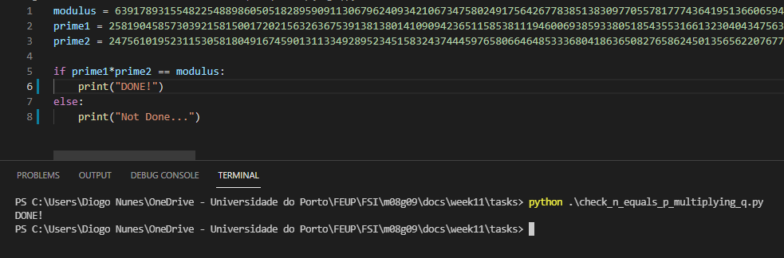
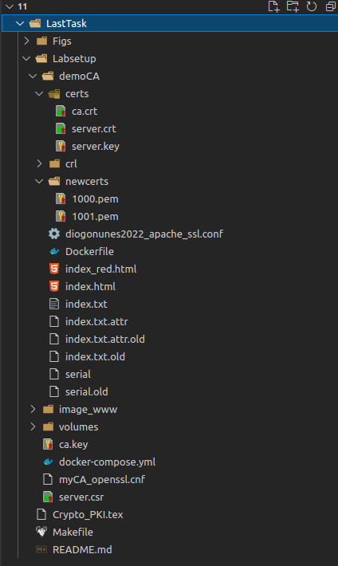
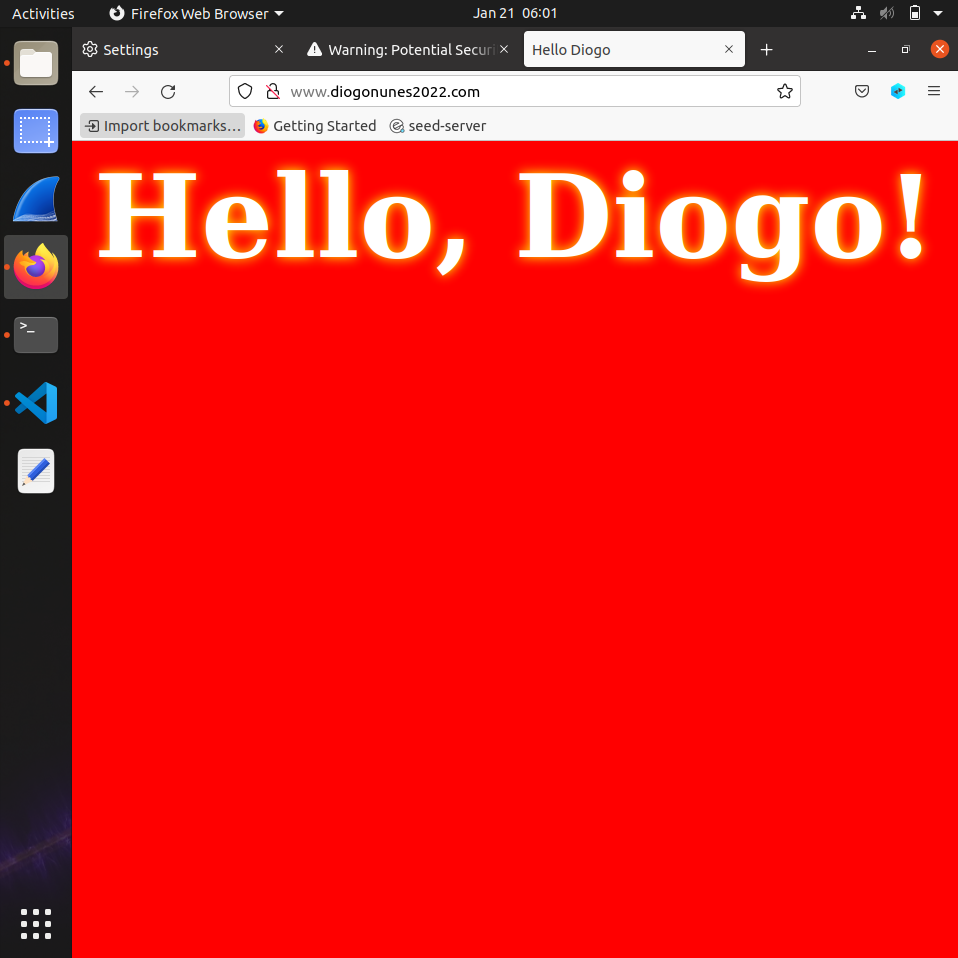
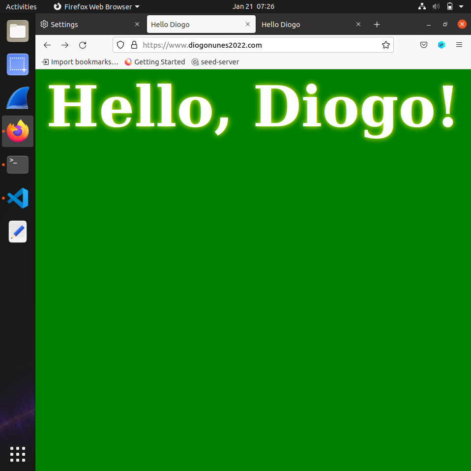
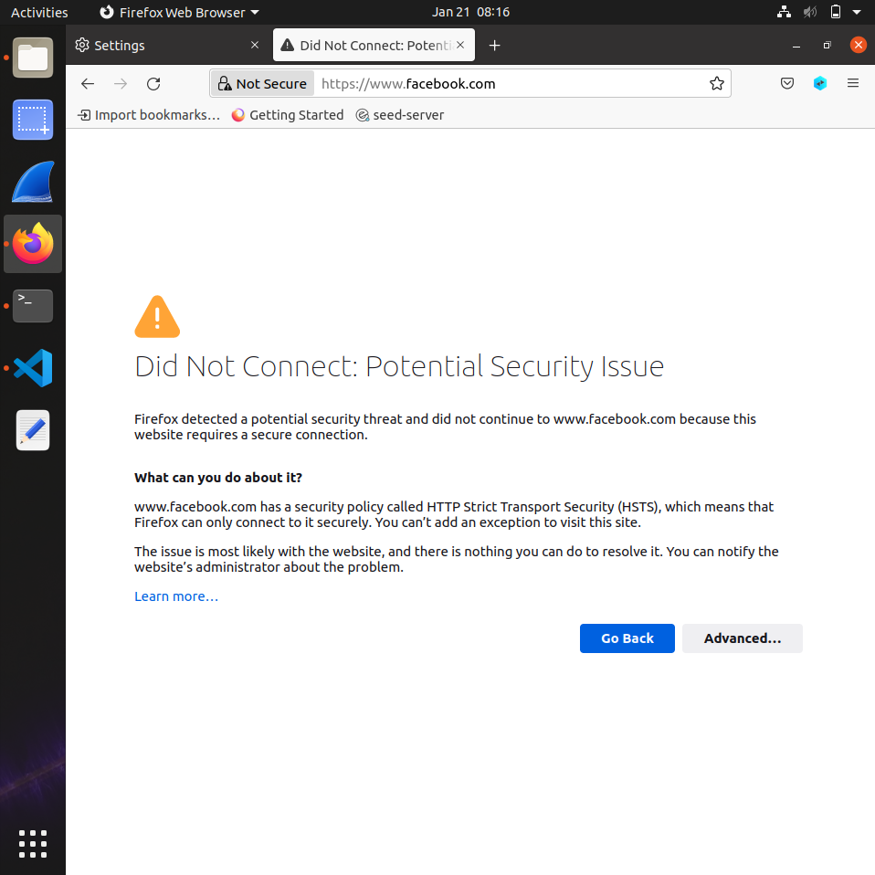
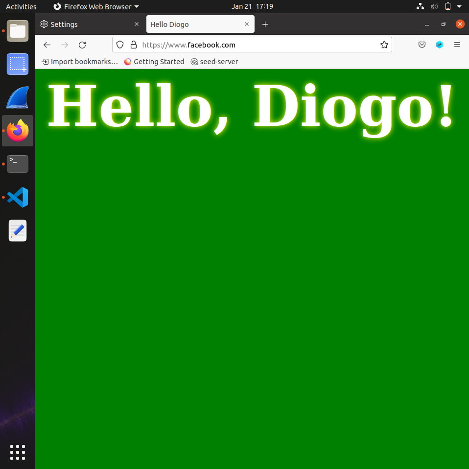

# Week \#10 Tasks

P.S.: Some files mencioned here might not be synchronized with the files used, because we tried to restart the tasks multiple times and, for example, we didn't calculate the values for the elements mentioned on question 3 of Task 1.

## Task 1: Becoming a Certificate Authority (CA)

- We were able to copy the `openssl.cnf` file to our `Labsetup` directory using the command: `cp /usr/lib/ssl/openssl.cnf .` (on a console already on `Labsetup` directory).
- We renamed it to `myCA_openssl.cnf` for simplicity, to be used later.
- We manually added some sub-directories and files, just like the instructions given:
```powershell
# create demoCA folder
mkdir demoCA
cd demoCA
# uncomment unique_object line on openssl.cnf file
# see the directories needed and add them:
mkdir certs crl newcerts
# create index.txt empty file
touch index.txt
# create serial file with a single number in string format (e.g. 1000)
touch serial
echo "1000" > serial
```

When running the command: `openssl req -x509 -newkey rsa:4096 -sha256 -days 3650 -keyout ca.key -out ca.crt`, we were able to generate a RSA private key.

We now have:
- `ca.key` containing the CA's private key;
- `ca.crt` containing the public-key certificate.

By running the following commands, we were able to answer the next questions:
- `openssl x509 -in ca.crt -text -noout`
- `openssl rsa -in ca.key -text -noout`

1. What part of the certificate indicates this is a CA's certificate?
  - Answer: `CA:TRUE`
2. What part of the certificate indicates this is a self-signed certificate?
   - Answer: Issuer is equal to Subject and Subject Key Identifier is equal to Authority Key Identifier.
3. In the RSA algorithm, we have a public exponent e, a provate exponent d, a modulus n, and two secret numbers p and q, such that n = pq. Please identify the values for these elements in your certificate and key files.
   - e: publicEsponent: 65537 (0x10001)
   - d: privateExponent. In decimal: 629484501569234352710112850148717619342469978452807970304024780239307648438762808684439497127745835553507178306915694787342489308529369962436213517309604090490024854674252797291146071797747174292325777150660886049961664894166144847479964365261298230558221087277180109992432769768413005998607970472955516958869551756500929369257498742951894335032314110827313094379803831366352843906845013533636610296787624011162370655243486262589529429892499874548414003141237755691412877306067186080470590889660194705239982159295386684095615383228394491091147627059310641534347664974225582136966960192984686114835792354835562245297389127085678101860448855673611392618654086257398604544538061535588277256350033066777989611659822236041814026743757991490594197825283323390963692220967402514578676587115023073060041702436412257209128184476545250853028218870261175021704269618207300977246372925608776089515011771759477391040538129561832520175127853502024067930328235740708318151791103711584930427065985898102293230749879155255717734456165077455286834152077006850233784152098231293926938652596014680629413823977912285728877552191320642313944236372446071365503161590023526360819373503738098728729102118732651146025752851087670630290847152499544788330804397
   - n: modulus. In decimal: 639178931554822548898605051828959091130679624093421067347580249175642677838513830977055781777436419513660659478182512267450610009034121736333639980848729115139438186957323111353203912235392785609534023164756247603246481139224495837957554260045701348497809760886301424919419091649171609223785237142464492120500035843790982880762107356596970996622604618336451950891176482287105748588118024448103474102855003870590897318573545685687525994249798805111002099745399172563223366437998313901674869701372111311796983573334703331353893456620226666914158654456502510175178453425093689114395111323732044898873515695874970839131404730080398521478041195088945173049186185277268864883847727518039869558167638231670213677464257491010008029463411388101015037864054589730543017199763715626584831355585555834078357437064878235793371498535749404843074138404277245157783589470633330331060780224358001049649886794345499990532742617659309856002854597925561631052659022805590319047516626894859805903459103124971881873912498155029579789034417878965098419752740240354974910334381079157334044343822993211773713850193475693549439547162947506412092041604497603196359168492537253675746171412899548195796268729122721942183686784997182877406914898545092744378993409
   - p: prime1. In decimal: 25819045857303921581500172021563263675391381380141090942365115853811194600693859338051854355316613230404347563978002444881404834179876863054784969455750672833641070956000573113681580441413511005456580866896167466544785732882526729648991225701475155299165943552567801876547359508025980134380915466405315545342189611787671399573499191791105715782986534252050874219855042990498974785681856448047054063154187070553759241735200545744148691511722157675247581166003007568671430965643345549228017816155840618944541615919607523625223228665112746257485654623833793378753747825530504718795995253818317178167782972885313944844627
   - q: prime2. In decimal: 24756101952311530581804916745901311334928952345158324374445976580664648533368041863650827658624501356562207677508971105848211793248073804017561559816344505399816355779683591858251410090530865179365054383301804918247116331275625305759860194818723091015080304609372349170155100582777609911496396937589202237761945289710136466219068913230583941808573909619397106635348080371138698149873327260181493735906012809483023310616604224523333850915748020992019908851232583325785276206274046250781720723663194303923828651004623206610884651174066047487240499851349616387749312589790818387845027976284162705061358273001214534114267

We did a [Python Script](docs/week11/tasks/check_n_equals_p_multiplying_q.py) to check that n=p*q:



## Task 2: Generating a Ceretificate Request for Your Web Server

- Generate a CSR for `www.diogonunes2022.com`:
```shell
openssl req -newkey rsa:2048 -sha256 \
-keyout server.key -out server.csr \
-subj "/C=PT/O=FEUP/CN=Diogo Nunes" \
-passout pass:dees
```

- Adding two alternative names to our certificate signing request:
```
openssl req -in server.csr -text -noout -addext "subjectAltName = DNS:www.diogonunes2022.com, DNS:www.diogonunes2022Acom, DNS:www.diogonunes2022B.com"
```

## Task 3: Generating a Certificate for your server

- Turning `server.csr` into an X509 certificate (`server.crt`), using the CA's `ca.crt` and `ca.key`:
```shell
openssl ca -config myCA_openssl.cnf -policy policy_anything \
-md sha256 -days 3650 \
-in server.csr -out server.crt -batch \
-cert ca.crt -keyfile ca.key
```

- Uncomment `copy_extensions = copy` line on `myCA_openssl.cnf` file;
- Run `openssl x509 -in server.crt -text -noout` and verify that alternative names are included:
```
Certificate:
    Data:
        Version: 3 (0x2)
        Serial Number: 4097 (0x1001)
        Signature Algorithm: sha256WithRSAEncryption
        Issuer: C = PT, ST = Some-State, O = FEUP, CN = Diogo Nunes
        Validity
            Not Before: Jan 21 12:07:22 2022 GMT
            Not After : Jan 19 12:07:22 2032 GMT
        Subject: C = PT, O = FEUP, CN = Diogo Nunes
        Subject Public Key Info:
            Public Key Algorithm: rsaEncryption
                RSA Public-Key: (2048 bit)
                Modulus:
                    00:b9:32:42:57:d8:f4:7a:7e:20:b7:65:81:38:2f:
                    ea:7c:76:99:8f:de:4e:4d:46:0a:82:8d:fb:42:40:
                    61:8b:e9:3d:fe:13:09:75:1b:78:06:fd:cc:30:ec:
                    75:50:70:e7:ee:60:dd:ee:0a:f1:f7:23:3f:61:80:
                    18:92:fc:46:80:82:5d:46:38:4d:9c:5a:6d:05:6b:
                    0c:b5:92:89:63:90:4a:e6:f6:fc:3d:4b:b4:0a:4f:
                    5e:cb:93:e7:bc:63:7a:d3:0c:99:c2:31:d5:ba:99:
                    04:3b:db:da:e0:32:d7:ad:cd:75:7f:58:cf:ef:d1:
                    fc:99:09:8e:fa:69:bf:9f:ea:0a:97:e2:63:a5:53:
                    d6:21:5b:6f:83:ea:70:ee:e4:ff:5b:b3:cd:ac:51:
                    ea:27:58:43:f8:bd:be:71:37:bc:be:79:00:e1:0f:
                    40:fc:85:e7:71:67:28:18:9f:cb:c3:d0:73:84:4c:
                    55:03:9f:02:25:ca:95:39:43:0d:58:85:3a:80:8f:
                    7d:d4:10:bf:d8:33:d2:59:7d:9e:aa:c6:85:31:70:
                    fa:fc:03:f5:3c:2e:9c:70:cd:7d:65:06:6f:29:89:
                    ca:34:9c:b4:ca:fa:e2:c1:06:38:b1:d4:98:7a:be:
                    8f:ff:36:e3:95:ae:3b:1c:84:c1:cd:1f:81:97:1d:
                    a2:cb
                Exponent: 65537 (0x10001)
        X509v3 extensions:
            X509v3 Basic Constraints: 
                CA:FALSE
            Netscape Comment: 
                OpenSSL Generated Certificate
            X509v3 Subject Key Identifier: 
                14:EF:05:75:B9:3A:CE:98:21:80:66:96:17:00:CE:C0:9C:52:00:DC
            X509v3 Authority Key Identifier: 
                keyid:44:B3:FA:32:68:71:DF:AA:95:52:82:33:E9:C9:80:EB:88:A0:77:6E

            X509v3 Subject Alternative Name: 
                DNS:www.diogonunes2022.com, DNS:www.diogonunes2022A.com, DNS:www.diogonunes2022B.com
    Signature Algorithm: sha256WithRSAEncryption
         4f:e3:a7:fb:25:24:d6:ac:83:38:3d:5e:50:8f:ca:1d:f6:75:
         15:ce:2c:69:7d:88:35:bf:0e:d6:d0:40:df:f3:69:83:a3:b4:
         58:e5:bc:ad:ea:b7:f3:9b:8c:3b:22:34:56:e8:9c:d4:62:be:
         4b:e9:a2:10:fa:c9:be:7b:69:ca:b5:46:6d:37:46:41:3d:64:
         18:7f:f0:8e:ce:c9:f7:fc:af:17:ba:4a:ab:ac:33:72:88:3f:
         bb:95:0f:ea:1c:b8:7c:44:63:da:8c:8f:73:66:7c:8c:d8:11:
         f9:2b:c1:39:03:25:57:1b:4c:c1:9d:c8:d9:e1:c7:e6:25:0f:
         24:95:17:9c:47:b9:da:90:48:a3:03:20:5f:5c:4e:eb:27:92:
         27:97:18:5d:4e:5a:1b:af:88:bc:dc:e8:fb:c6:4c:95:16:2f:
         8f:30:5b:50:9b:21:26:9c:3a:7e:62:1d:36:25:32:5e:d6:2b:
         fe:d3:2d:ac:54:58:0d:d0:c2:d2:69:c0:51:61:3d:4b:ca:9d:
         a5:16:9f:95:ee:be:8a:3d:89:5a:2d:fd:e1:60:e9:46:62:ce:
         ff:b7:f6:a5:0b:20:07:06:f8:e5:28:a2:e4:a7:6f:11:b8:78:
         05:29:cc:74:ed:94:90:1c:0e:f5:3d:a8:5c:d8:8b:60:9d:87:
         f5:e8:fd:59:89:de:8d:9d:6e:45:0f:db:18:0a:32:0e:1d:d4:
         81:2b:72:b5:a5:03:cf:7a:b8:4b:ea:5b:3a:55:32:a0:b7:92:
         22:c9:49:d7:e0:7c:a0:7f:38:fc:85:94:be:4b:93:00:6f:66:
         a4:af:dc:80:fe:31:fe:ee:c5:06:92:06:4c:f4:ec:6b:5e:8b:
         e7:c8:3e:b1:e9:25:02:06:b0:f1:f7:79:cf:02:e2:86:54:56:
         ef:11:d7:12:11:62:2b:bc:7e:c2:96:40:a7:3b:69:97:03:dc:
         49:61:93:63:7c:5f:0b:53:15:38:69:f8:a8:70:41:13:27:31:
         1a:3e:2d:26:4c:61:9d:f5:08:e7:ea:7e:39:eb:c8:09:83:47:
         e4:b7:a4:94:4f:4e:2b:f3:af:a0:6c:db:e0:3c:69:9b:06:34:
         11:1a:96:e5:c2:93:a3:ff:f7:61:ec:d0:6b:6f:46:c0:48:35:
         ae:c9:3d:18:4c:92:d4:42:69:2b:23:f0:cb:e4:6a:29:99:41:
         07:15:6f:f1:5c:55:ca:e9:d0:1a:53:2a:fe:64:11:7e:23:e6:
         bb:bf:07:30:68:fa:08:05:d6:3d:93:b8:bf:0f:c5:a2:65:a6:
         1b:d4:08:a6:99:c6:1b:3e:19:c3:8a:f4:8c:16:3a:8a:fb:78:
         d8:1c:e1:22:06:4b:65:60
```

## Task 4: Deploying Certificate in an Apache-Based HTTPS Website

On the tasks above, we were already explaining the process until now.

Now we did some modifications to be able to run our HTTPS site:

- we modified the `docker-compose.yml` file:
```yml
version: "3"

services:
    web-server:
        build: ./demoCA
        image: seed-image-www-pki
        container_name: www-10.9.0.80
        tty: true
        volumes:
            - ./volumes:/volumes
        networks:
            net-10.9.0.0:
                ipv4_address: 10.9.0.80

networks:
    net-10.9.0.0:
        name: net-10.9.0.0
        ipam:
            config:
                - subnet: 10.9.0.0/24
```

- we created a `Dockerfile`:
```dockerfile
FROM handsonsecurity/seed-server:apache-php

ARG WWWDIR=/var/www/diogonunes2022

COPY ./index.html ./index_red.html $WWWDIR/
COPY ./diogonunes2022_apache_ssl.conf /etc/apache2/sites-available
COPY ./certs/server.crt ./certs/server.key  /certs/

RUN  chmod 400 /certs/server.key \
     && chmod 644 $WWWDIR/index.html \
     && chmod 644 $WWWDIR/index_red.html \
     && a2ensite diogonunes2022_apache_ssl   

CMD  tail -f /dev/null
```

- we created a `diogonunes2022_apache_ssl.conf` file:
```conf
<VirtualHost *:443> 
    DocumentRoot /var/www/diogonunes2022
    ServerName www.diogonunes2022.com
    ServerAlias www.diogonunes2022A.com
    ServerAlias www.diogonunes2022B.com
    ServerAlias www.diogonunes2022W.com
    DirectoryIndex index.html
    SSLEngine On 
    SSLCertificateFile /certs/server.crt
    SSLCertificateKeyFile /certs/server.key
</VirtualHost>

<VirtualHost *:80> 
    DocumentRoot /var/www/diogonunes2022
    ServerName www.diogonunes2022.com
    DirectoryIndex index_red.html
</VirtualHost>

# Set the following gloal entry to suppress an annoying warning message
ServerName localhost
```



After we made `dcbuild` and `dcup`, we openned a shell inside our container to enable Apache's ssl module and then enable our site:
- `a2enmod ssl // Enable the SSL module`
- `a2ensite diogonunes2022_apache_ssl // Enable the sites described in this file`
- `service apache2 start`

At this point, we aren't able to browse on our web server, because the browser still don't have a valid Certificate for that domain. For that, we need to load `ca.crt` on Firefox. After that, we can now browse our site and compare the differences between:

- HTTP Version:



- HTTPS Version:



## Task 5: Launching a Man-In-The-Middle Attack

### Step 1: Setting up the malicious website

We changed the VirtualHost entry on `diogonunes2022_apache_ssl.conf` file with our target website: Facebook. After this step, our configuration file looks like this:
```powershell
<VirtualHost *:443> 
    DocumentRoot /var/www/diogonunes2022
    ServerName www.facebook.com
    ServerAlias www.diogonunes2022A.com
    ServerAlias www.diogonunes2022B.com
    DirectoryIndex index.html
    SSLEngine On 
    SSLCertificateFile /certs/facebook.crt
    SSLCertificateKeyFile /certs/facebook.key
</VirtualHost>

<VirtualHost *:80> 
    DocumentRoot /var/www/diogonunes2022
    ServerName www.diogonunes2022.com
    DirectoryIndex index_red.html
</VirtualHost>

# Set the following gloal entry to suppress an annoying warning message
ServerName localhost
```

### Step 2: Becoming the man in the middle

We added an entry on `/etc/hosts` file mapping the hostname to our malicious web server: `10.9.0.80   www.twitter.com`.

### Step 3: Browse the target website


At this time, we managed to launch a Man-In-The-Middle attack, but our Certificate is still only valid to the domain created until task 4.

## Task 6: Launching a Man-In-The-Middle Attack with a Compromised CA

For this task, we had to:
- Generate a new Certificate Request, just like we did for our web server:
```
openssl req -newkey rsa:2048 -sha256 \
-keyout server.key -out server.csr \
-subj "/CN=www.facebook.com/O=FEUP Inc./C=PT" \
-passout pass:dees
```

- Generate a new Certificate, just like we did for our web server. This is done because the CSR file needs to have the CA's signature to form a Certificate.
```
openssl ca -config myCA_openssl.cnf -policy policy_anything \
-md sha256 -days 3650 \
-in server.csr -out server.crt -batch \
-cert ca.crt -keyfile ca.key
```

- Rename both `server.crt` and `server.key` to `facebook.crt` and `facebook.key` respectively (just to avoid substitute the ones used for our web server).
- Configure `Dockerfile` to have both `facebook.crt` and `facebook.key` files. At this point, our Dockerfile looks like this:
```dockerfile
FROM handsonsecurity/seed-server:apache-php

ARG WWWDIR=/var/www/diogonunes2022

COPY ./index.html ./index_red.html $WWWDIR/
COPY ./diogonunes2022_apache_ssl.conf /etc/apache2/sites-available
COPY ./certs/facebook.crt ./certs/facebook.key  /certs/

RUN  chmod 400 /certs/facebook.key \
     && chmod 644 $WWWDIR/index.html \
     && chmod 644 $WWWDIR/index_red.html \
     && a2ensite diogonunes2022_apache_ssl   

CMD  tail -f /dev/null
```

After these steps and restarting the Docker container and Apache, we were able to successfully launch an MITM attack.



For simplicity, for all tasks done on this LOGBOOK, we used the given `index.html` and `index_red.html` files (modificated), but for a more credible MITM Attack, we would have used more sofisticated files, obviously.