# Week \#4 Tasks and Week \#4 CTF

## Week \#4 Tasks:

- **Task 1**:

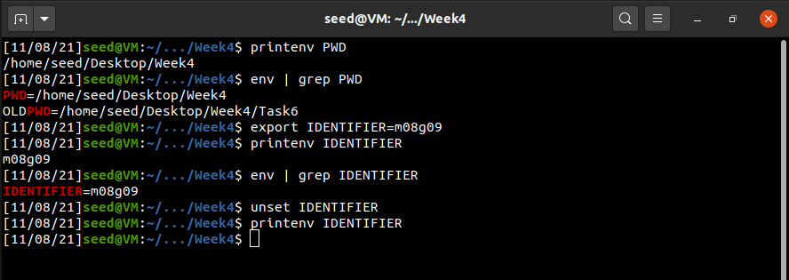

- **Task 2**:
  - **Step 1**: Environment variables printed for the child process.
  - **Step 2**: Environment variables printed for the parent proccess.
  - **Step 3**: Environment variables don't change for parent and child processes. Only change is the name of the binary file executed ("_=./out1" instead of "_=./out2", in our case).

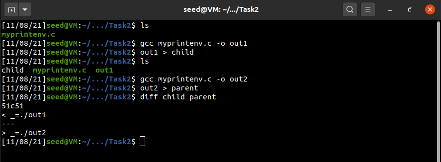  

- **Task 3**:
  - **Step 1**: Nothing printed.
  - **Step 2**: Environment variables printed.
  - **Step 3**: Using execve(), environment variables aren't automatically inherited by the new program. They need to be passed as a parameter ("environ").

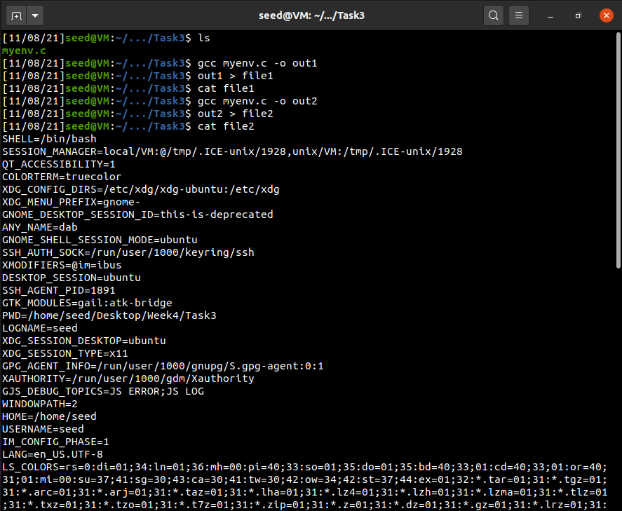
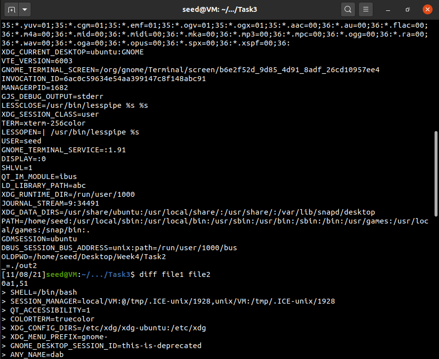
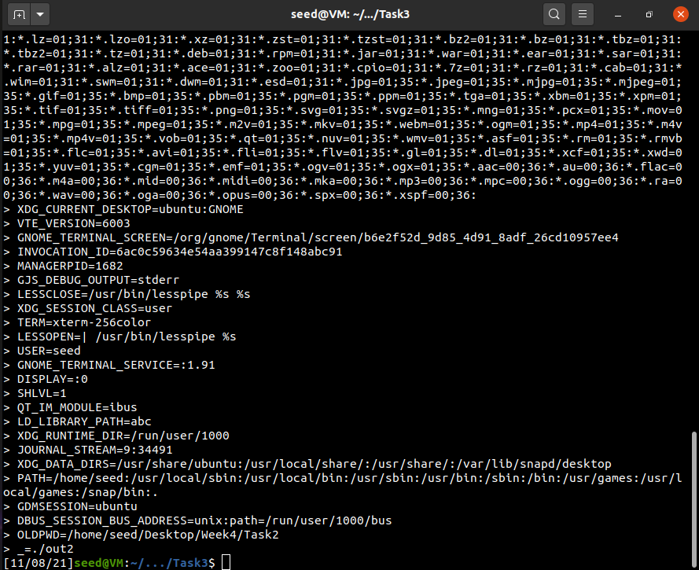

- **Task 4**: Using system(), environment variables of the calling process are passed to the new program /bin/sh automatically.

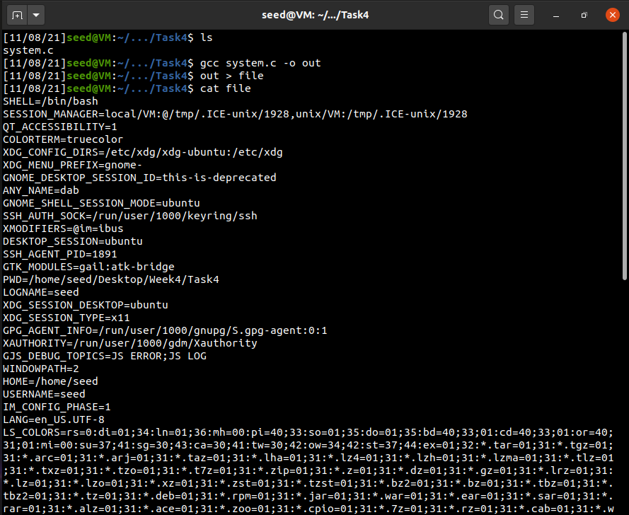
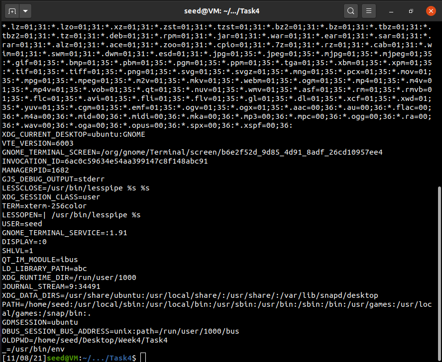

- **Task 5**:
  - **Step 3**: Not all environment variables we set in the shell process (parent) get into the Set-UID child process: LD_LIBRARY_PATH is not set, in constrast with PATH and ANY_NAME, that are set.

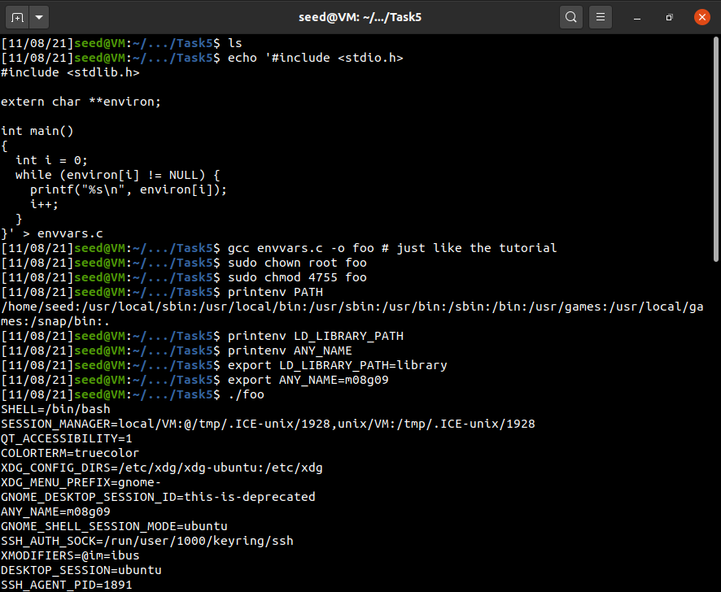
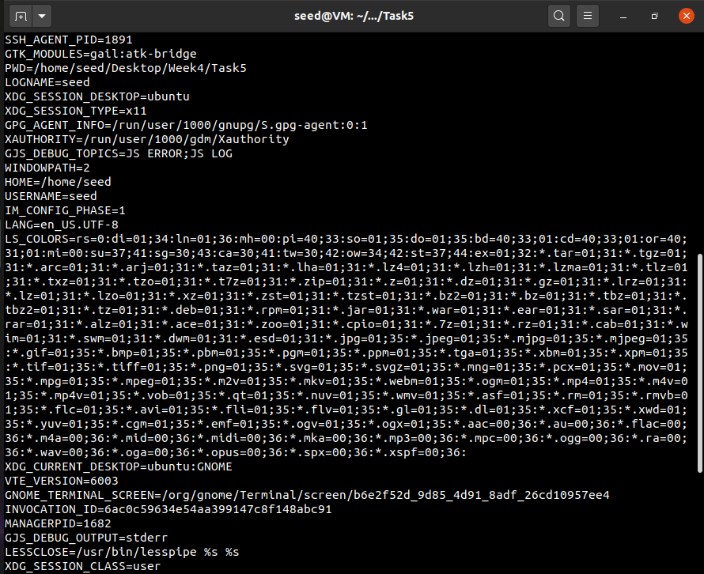
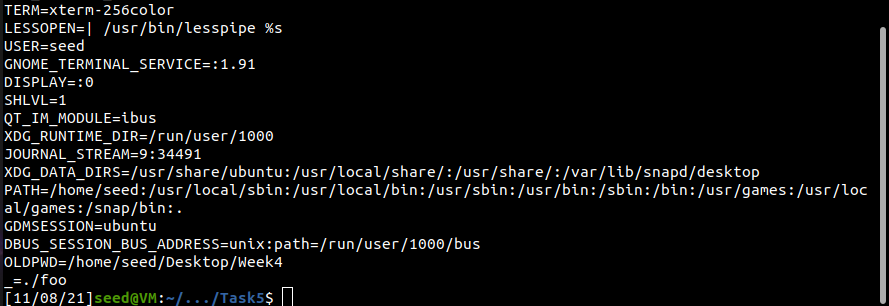  

- **Task 6**:
  - **Can you get this Set-UID program to run your onw malicious code, instead of /bin/ls?**
    - R: Yes, because we put the VM Home directory path "on top" of the old environment variable PATH, so our ```system("ls")``` program will run instead of ```/bin/ls``` command.
  - **If you can, is your malicious code running with the root privilege?**
    - R: Yes, because we changed the **program ownership to root** and we make the program a **Set-UID program** (we allowed that file to be accessed by the file owner; on this case, root).

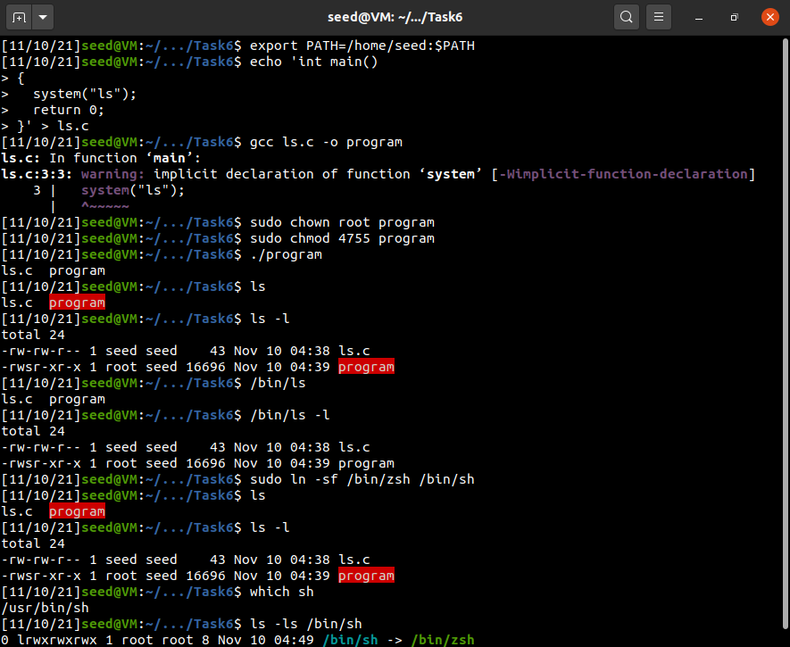  

## Week \#4 CTF:

### **Acknowledgment**

By inspecting the elements of the web page, it was possible to find the use of the plugin "WooCommerce" with version 3.9.1.

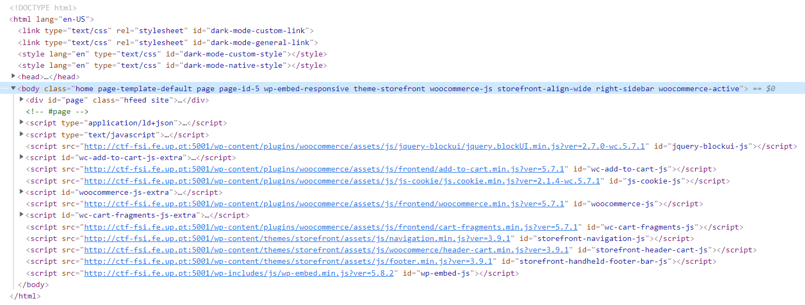

### **Search for Vulnerabilities**

After searching for "WordPress" in the list of CVEs, we filtered the results for vulnerabilities related to the use of the "WooCommerce" plugin.

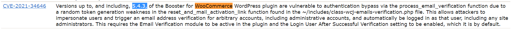

### **Vulnerability Choice**

Since the purpose of this CTF is to find a vulnerability that allows logging in as another user, we chose a CVE that allowed admin authentication, compatible with the WooCommerce version used, giving us the Challenge 1 Flag: **<ins>flag{CVE-2021-34646}</ins>**.

### **Find an Exploit**

After noticing the vulnerability in general, we searched for "CVE-2021-34646" on GitHub and found a PoC of that vulnerability, with a script that allowed executing the exploit.


### **Exploring the Vulnerability**

After adapting the script to attack the website provided in the CTF, we got a url that allowed authentication as admin. After using that url, we accessed the link provided to look for the Challenge 2 Flag, found in the post 'Message to our employees': **<ins>flag{701f07c41afaf7d487aa7246d7f7c88d}</ins>**.

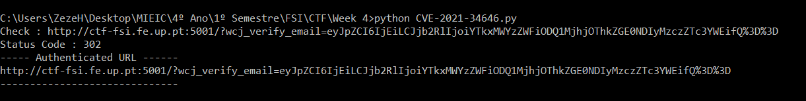
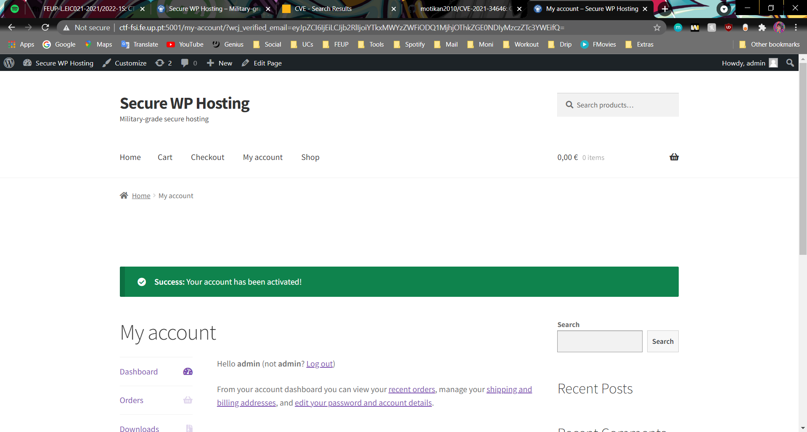

