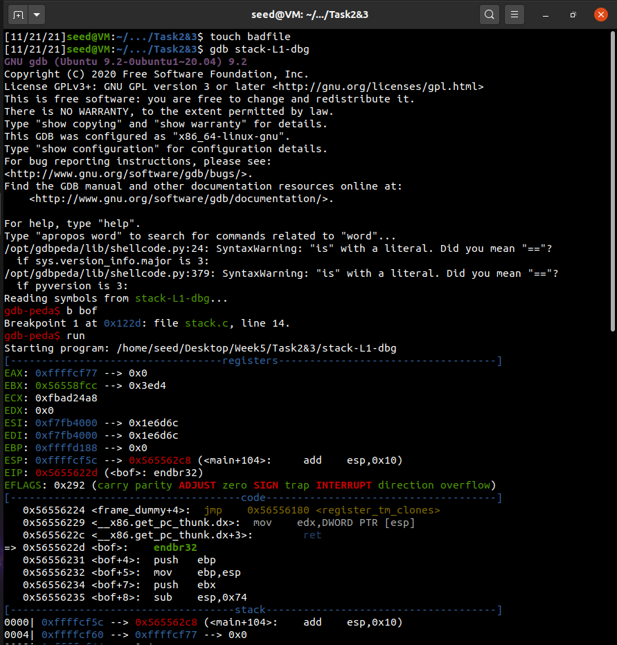
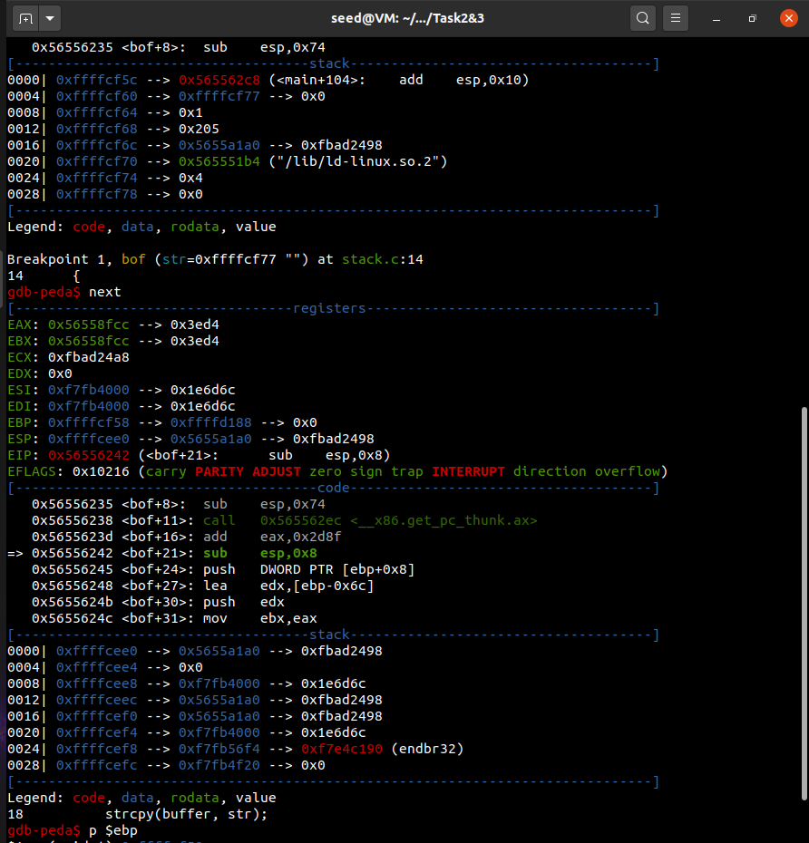
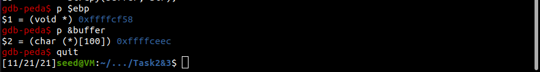
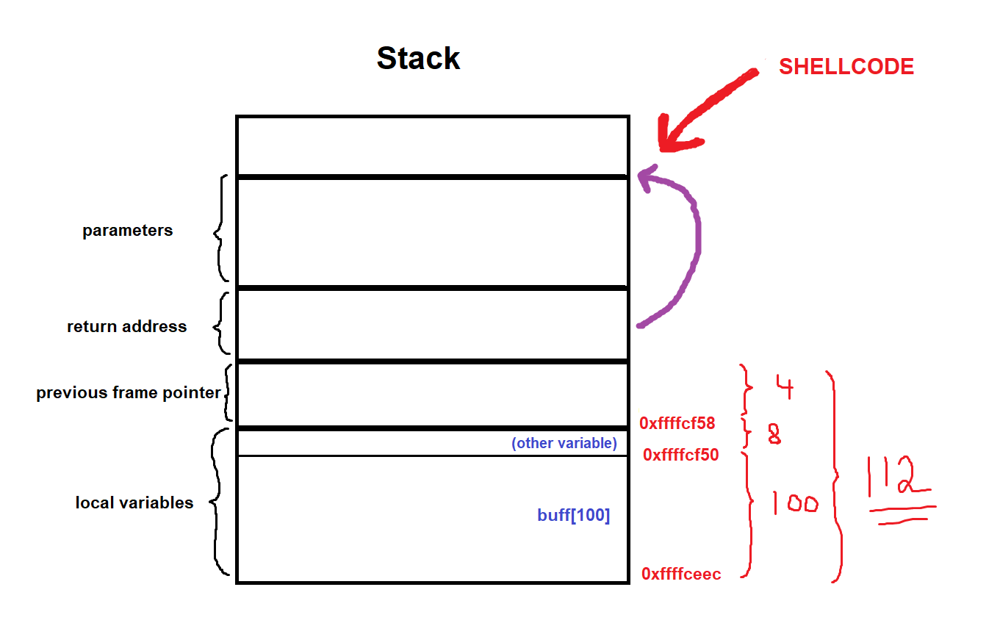
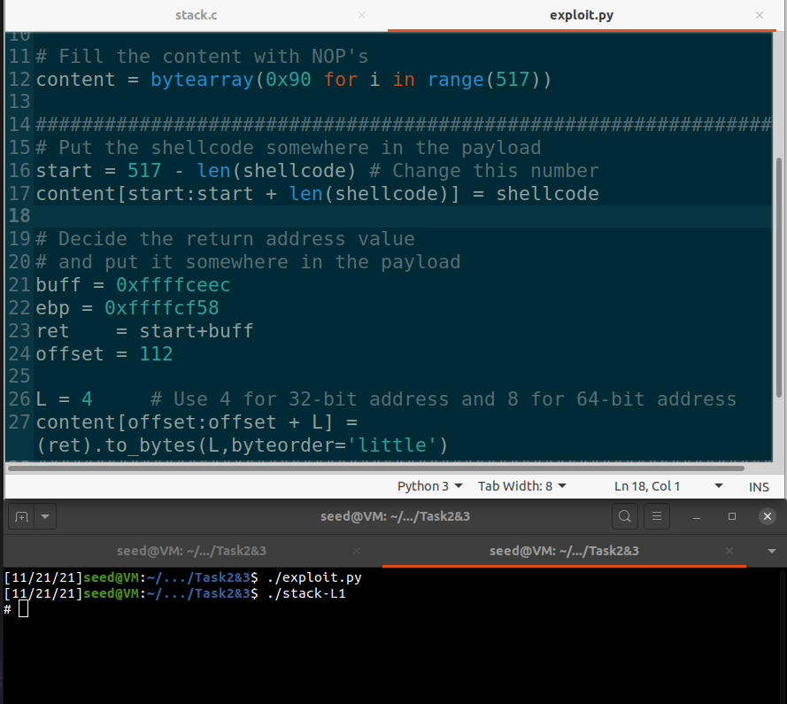

# Week \#5 Tasks and Week \#5 CTF

## Week \#5 Tasks:

- **Task 1**: Invoking the shellcode -> Both a64.out and a32.out spawn a new shell.

    

- **Task 2**: Understanding the vulnerability in the stack.c program
- **Task 3**:

    **Debugging:** 
    - Break point at function bof(): 0x122d
    - run
      - EBP: 0xffffd188 -> 0x0
      - Breakpoint 1, bof (str=0xffffcf77)
    - next
      - EBP: 0xffffcf58 -> 0xffffd188 -> 0x0 -> 
    - EBP value: 0xffffcf58
    - Buffer address: 0xffffceec  
  

      
      
      
    
    
    **Resolution:** Having a String with 517 bytes being written to a buffer with 100 bytes will result in a buffer ouverflow. It is known that the stack reserves memory space for local variables, then for the previous frame pointer and only then for the return address. We need to calculate the distance between the buffer pointer and the return address pointer in order overwrite a latter with an address to wich we'll inject our shellcode. We chose to store our shellcode the closest to the end of the String so that we can maximize NOP operations. After debbuging, we calculated that the offset between the buffer and the return pointer is 112 bytes. With this information, we had everything we needed to perform the exploit.

    

    - start = **517 - len(shellcode)** 
    - content[start:start + len(shellcode)] = shellcode
    - **buff = 0xffffceec**
    - **ebp = 0xffffcf58**
    - ret = **start + buff**
    - offset = **112**

    

## Week \#5 CTF:

- **Challenge \#1**  
    After inspecting the program permissions and source code, it was clear that there was a stack overflow vulnerability on the `scanf("%28s", &buffer)` instruction. Since *meme_file* and *buffer* variables take up a total of 28 bytes of memory space, we noticed that if we could overwrite the stack with 20 arbitrary bytes followed by the string "flag.txt" (which is 8 bytes long) we could replace *meme_file* from "mem.text\0" to "flag.txt". This way, when the instruction `FILE *fd = fopen(meme_file,"r");` is executed, the contents from flag.txt would be read, giving us the flag: flag{a8526e2bdcbb0fd13070f88dc0a33590}.

    
    
- **Challenge \#2**  
    We quickly understood this challenge was similar to the first one. Buffer overflow vulnerability in `scanf("%32s", &buffer);` and local variables totaling up to 32 bytes of memory space. The same overwrite to *meme_file* would have to be done, but the condition `*(long*)val == 0xfefc2122` would need to be true aswell. This way, we need to send 20 arbitrary bytes, followed by "\x22\x21\xfc\xfe" (because the program uses little endian architecture, we need to pass the string reversed), followed by "flag.txt". By doing so, we can read the flag contents, giving us the flag: flag{5292b2921f6a84a693394f9b38ded7f9}.

    

