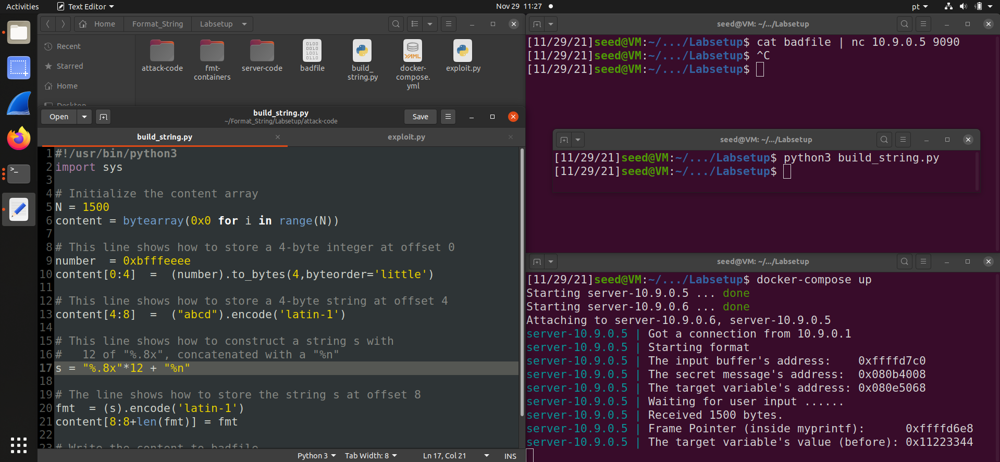
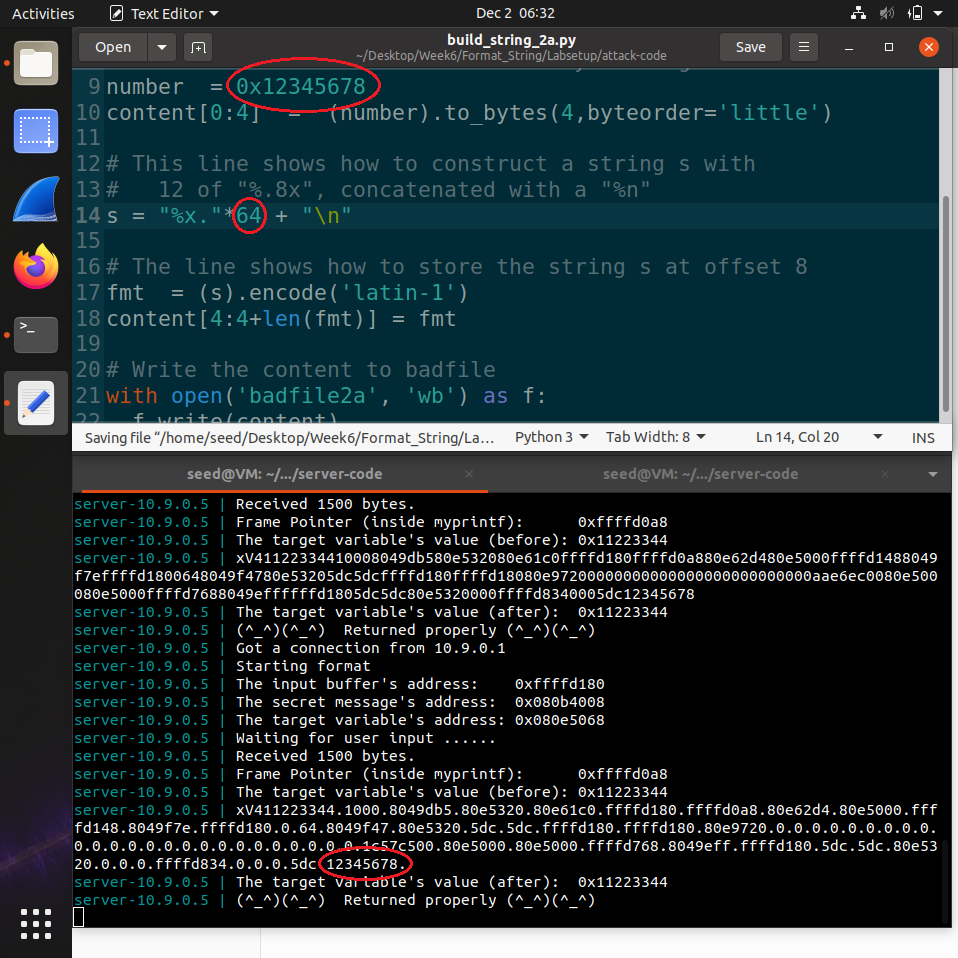
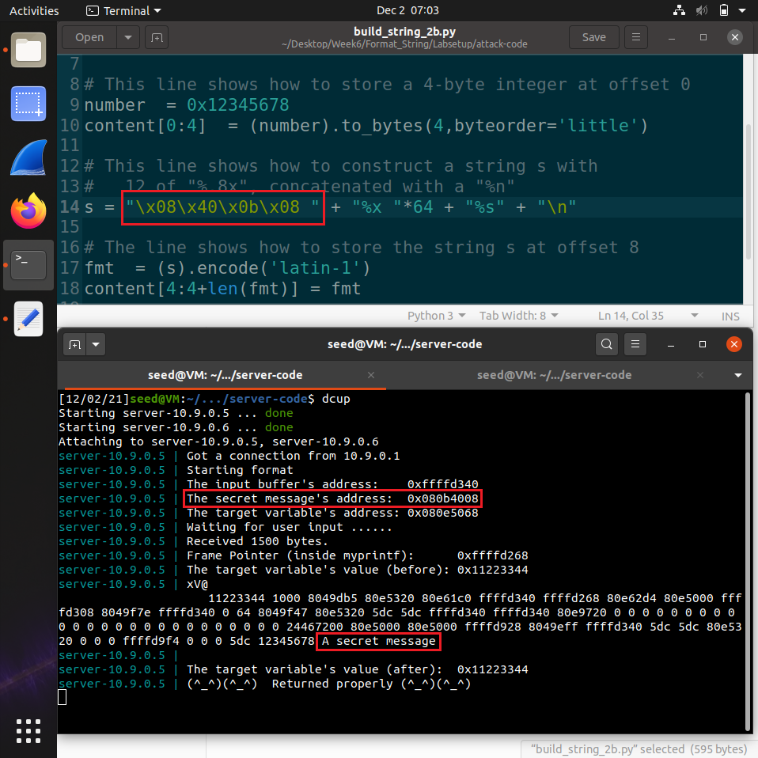
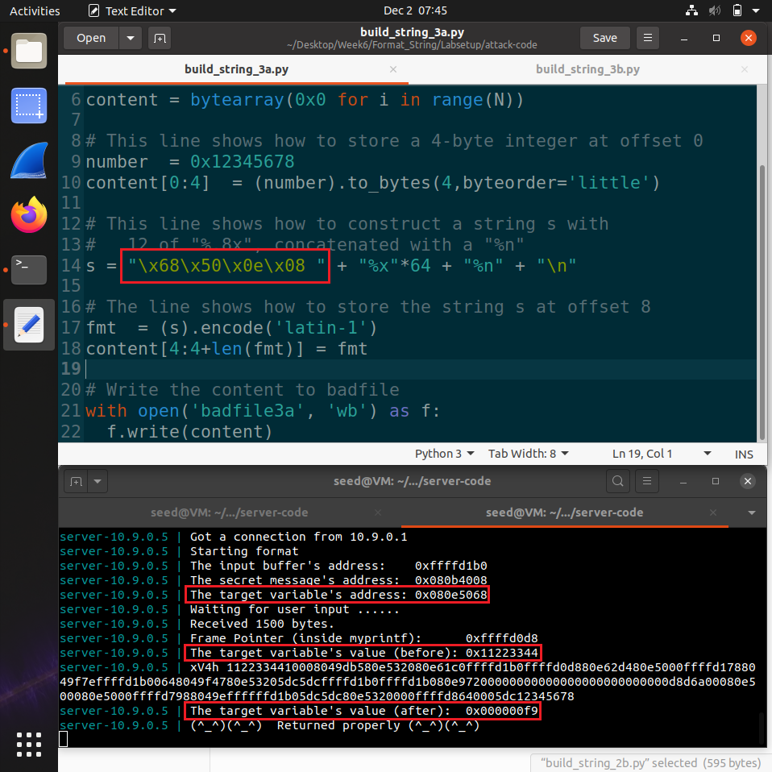
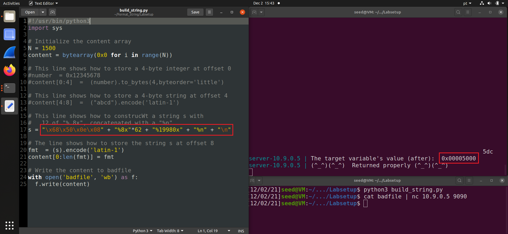
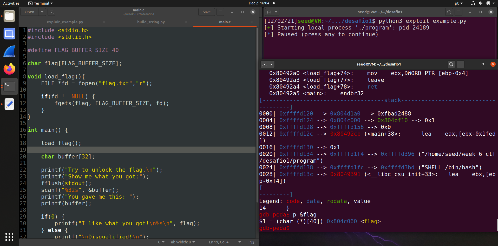
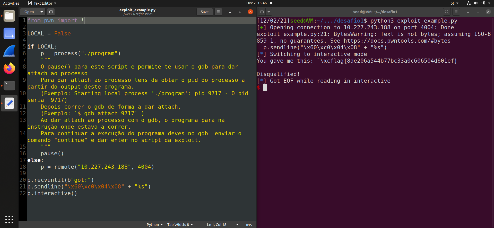
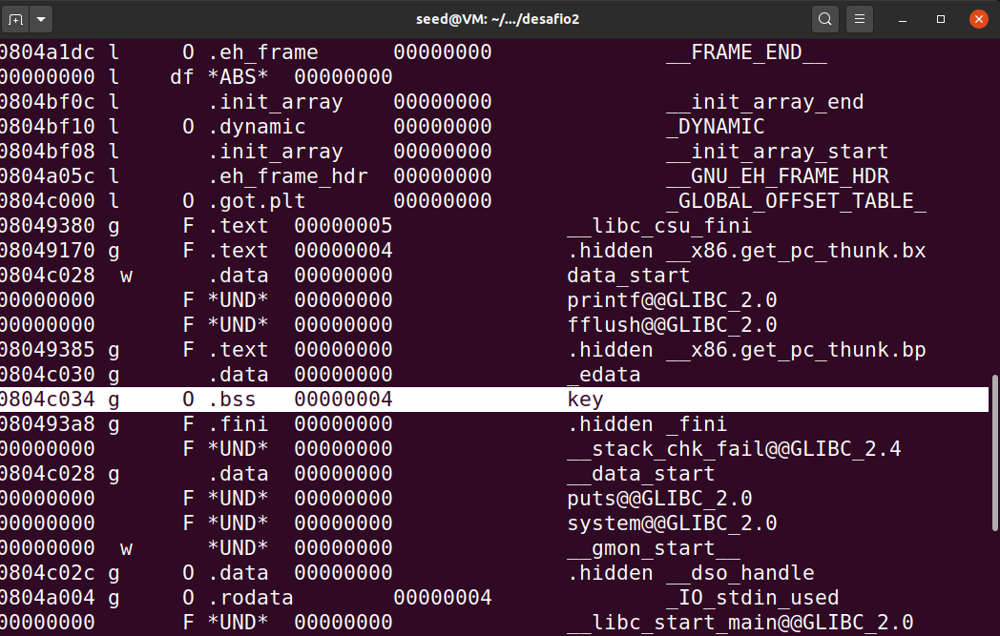
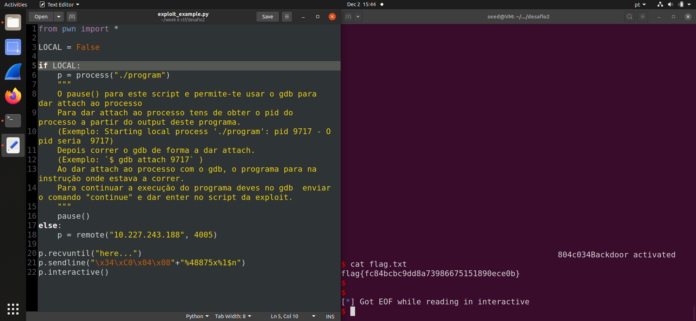

# Week \#6 Tasks and Week \#6 CTF

## Week \#6 Tasks:

- **Task 1**: Crashing the program -> after using the output of `build_string.py` as the input for the server, it didn't print out the input's contents, which means the format program has crashed.

    

- **Task 2.A**: Since the objective was to print out data from the stack, we placed a distinct integer at the beginning of content: `number = 0x12345678`. Then, after some attempts, we found out it was needed 64 %x format specifiers to print out our inserted number.

    

- **Task 2.B**: Since the the task involved reading the contents from a string, we knew we had to send an input with the string address with its bytes order reversed (because of little-endian system), followed by some %x format specifiers to skip ahead trash in the heap, and only then followed by the %s format specifier to read the secret message. Using the address `0x080b4008` provided in `format.c`, as well as the 64 %x format specifiers used in the previous task, it was possible to read the contents of the string.

    

- **Task 3.A**: In order to change the value of a variable, we need to send in the input the variable address, followed by an arbitrary number of bytes, only then followed by a "%n" format specifier. Since "%n" writes the amount of bytes printed so far to the specified variable, using the provided variable address `0x080e5068`, by inputing `"\x68\x50\x0e\x08" + "%x"*64 + "%n"`, we made it so that the number of bytes read by "%x"\*64 plus the 4 bytes used by "\x68\x50\x0e\x08" would be written to the variable's address.

    
    
- **Task 3.B**: This task is similar to the previous one, except we need to change the variables value to a specific value: 0x5000 (20480 in decimal). Because buffer only reads up to 1500 bytes, we cannot send 20480 bytes in the input. We can avoid this by inputing `"\x68\x50\x0e\x08" + "%8x"*62 + "%19980x" + "%n""`. This way, we are providing 4 bytes in the address, plus 496 bytes of trash read by the "%8x"\*62 format specifier ("%8x"\*62 means 62 sequences of up to 8 chars will be read from memory), plus 19980 characters by the "%19980x" format specifier, totalling up to 20480 characters. In doing so, the variable ends up with the value 20480 (0x5000).

    
    
## Week \#6 CTF: 

- **Challenge 1**: After investigating the main.c, we noticed a format string vulnerability in the `printf(buffer);` instruction. Because the instruction `printf("I like what you got!\n%s\n", flag);` is inside a `if(0)` case, it will never execute. Therefore, we must print the flag content in the `printf(buffer);` instruction. After debugging the program using gdb, we got the flag address: `0x0804c060`. Similar to **Task 2.B**, we needed to give as input the flag address, followed by the "%s" string format. Since in this case there is no trash between the address and the content, we could simply use `"\x60\xc0\x04\x08" + "%s"` giving us the flag: flag{8de206a544b77bc33a0c606504d601ef}.

    
    
    
- **Challenge 2**: After investigating the main.c, we noticed a format string vulnerability in the `printf(buffer);` instruction. Because the global variable `key` is initialized with 0 and to execute `system("/bin/bash");` the condition `if(key == 0xbeef)` must be true, we need to change the value of `key` from 0 to 0xbeef (48879 in decimal). In order to do so, we need to use "%n" format specifier inside the `printf(buffer);` to set the value of `key` to 0xbeef, similarly as done in **Task 3.B**. After debugging the program using objdump, we got the key address: `0x0804c034` (we also got the address by using gdb, but this method is faster). Because buffer only reads up to 32 bytes, we cannot send 48879 bytes in the input. We can avoid this by inputing `\x34\xC0\x04\x08"+"%48875x%1$n`. This way, we are providing 4 bytes in the address, plus 48875 characters by the "%48875x" format specifier, totalling up to 48879 characters. In doing so, the variable ends up with the value 48879 (0xbeef). After changing this value, the instruction `system("/bin/bash");` is executed, which gives us kernel access to the server's folder. Since the flag is written in a `flag.txt` in this directory, we can simply execute `cat flag.txt` to retrieve the flag: flag{fc84bcbc9dd8a73986675151890ece0b}.

    
    
