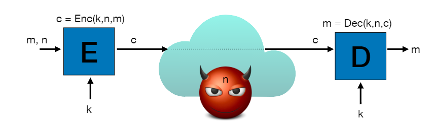
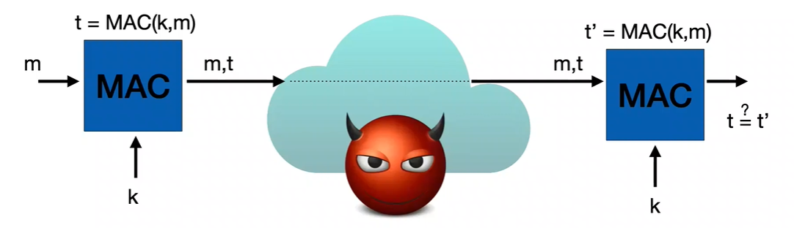
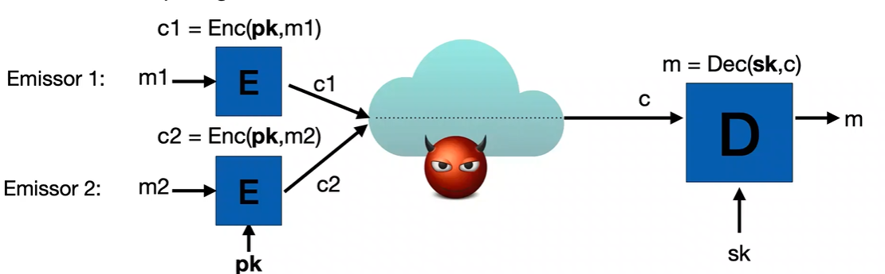
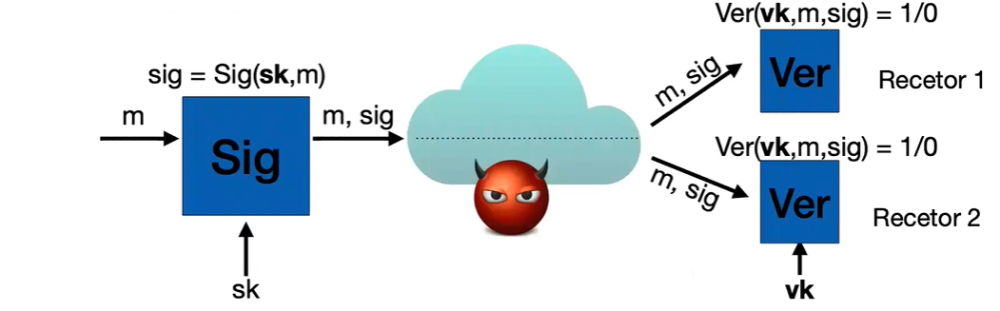

# FSI | Resumos Miniteste2

## 2. Criptografia

### 2.1. História da Criptografia

- Antes:
  - "Arte" onde o segredo e o obscurantismo eram princípios fundamentais;
  - Principalmente usada em meios militares/estatais.
- Hoje em dia:
  - Ciência: área multidisciplinar, princípios rigorosos;
  - Normas internacionais estabelecidas e públicas (escrutínio);
  - Utilização generalizada: todas as aplicações que usamos hoje em dia;
  - Componente central em muitos mecanismos de segurança, mas não é solução para todos os problemas;
  - Fiável se for bem implementada e corretamente utilizada.

Criptografia Moderna:
1. Definições precisas e rigorosas de segurança: modelos matemáticos da realidade.
2. Quando a segurança de uma construção criptográfica se baseia num pressuposto que não conseguimos provar.
3. As construções criptográficas devem ser justificadas formalmente.

### 2.2. Segurança da Informação

- Proteção da segurança da informação:
  - em trânsito: A => B, online/síncrono (ex.: HTTPS);
  - em trânsito: A => B, offline/assíncrono (ex.: email, WhatsApp, ...);
  - em repouso: A => A (ex.: Disk Encryption).
- Confidencialidade
  - informação acessível apenas a emissor A e recetor B (ou A);
  - cifras simétricas e assimétricas, acordos de chave.
- Autenticidade (e integridade)
  - recetor B (ou A) tem a certeza de que os dados vieram (sem alteração) de A;
  - assinaturas, acordos de chave, MAC (Message Authentication Code).
- Não-repúdio: assinaturas digitais/eletrónicas (emissor A não pode negar envio da mensagem).

### 2.3. Cifras

- Simétricas:
  - E, D: algoritmos (encrypt, decrypt) públicos;
  - k: chave secreta (hoje tipicamente 128 bits);
  - n: nonce (non-repeating, público);
  - m: texto-limpo;
  - c: criptograma.
  - Casos de Uso:
    - Chave usada apenas 1 vez: email cifrado usa chave fresca para cada mensagem: nonce não é relevante e pode ser sempre 0 (por exemplo).
    - Chave usada muitas vezes: cifrar disco ou HTTPS/TLS: nonce não se pode repetir: número de sequência ou valor aleatório.
  - Exemplo: One-Time Pad (Vernam, 1917): chave k aleatória do tamanho de m.
    - Cifrar: E(k,m) = m XOR k
    - Decifrar: D(k,c) = c XOR k = (m XOR k) XOR k = m
    - Primeiro resultado formal para uma garantia de segurança.
    - Problemas: chave do tamanho do texto-limpo (problemas de memória) e só pode ser usada uma vez.

- Sequenciais:
  - Solução para o comprimento da chave, mas ainda one-time: através de uma chave de tamanho menor que m, gerar uma chave do tamanho de m para usar como k.
    - E(k,m) = m XOR PRG(k), onde PRG é Pseudo Random Generator
  - Solução para só se poder usar uma vez: usar nonce público
    - Antes:
      - c1 = m1 XOR PRG(k)
      - c2 = m1 XOR PRG(k)
      - c1 XOR c2 = m1 XOR m2 
    - Com o nonce público:
      - c1 = m1 XOR PRG(k,n1)
      - c2 = m2 XOR PRG(k,n2)

- de Bloco: não são cifras, apenas permitem construir cifras. Dado um bloco e uma chave k, produz outro bloco do mesmo tamanho.
  - DES (até 2000): bloco de 64 bits, chave de 56 bits (já não se usa);
  - AES: Advanced Encryption Standard (desde 2000): bloco de 128 bits, chave de 128, 256, 512 bits.
    - Algoritmo criptográfico mais utilizado.
    - Processadores mais utilizados (Intel, AMD, ARM) oferecem AES-NI.
    - Como funciona:
      - Estado = matriz 4x4 bytes.
      - 1 round = 4 transformações: AddRoundKey, MixColumn, ShiftRow, ByteSub.
      - Cada round usa uma chave derivada da chave da cifra (key schedule).
    - O melhor ataque até hoje a uma chave de 128 bits é enumerar todas as 2^k chaves.
  - implementações pequenas e eficientes: iteração de uma transformação R(k, P_i) => transformação de round (10 rounds no AES 128, 14 no AES 256).
  - Electronic Code Book (ECB): inseguro: blocos do ficheiro iguais vão ter blocos de criptograma iguais.
  - Cipher Block Chaining Mode: seguro: Initialization Vector (IV) adicional aleatório (e público) antes da encriptação, garantindo que todo o criptograma mude caso haja padrões no ficheiro.
  - Counter Mode (CTR): seguro e mais usado: XOR entre uma cifra de bloco encriptada do nonce com o texto-limpo.
  - ChaCha20: cifra sequencial com nonce, PRG dedicado, estrutura parecida ao Counter Mode, componente central já assume counter e nonce no estado, popularidade crescente: eficiência em software.

Cifras que vimos não protegem contra ataques ativos:
- Se o adversário alterar o criptograma, o recetor pode não perceber;
- Processar um criptograma alterado pode comprometer confidencialidade.

Sempre necessário acautelar ataques ativos:
- integridade: mensagem não é alterada;
- autenticidade:
  - A e B partilham uma chave secreta;
  - B apenas aceita mensagens transmitidas por A.
- autenticidade => integridade.

### 2.4. Message Authentication Codes (MAC)

Checksum criptográfico, que para ser calculado é necessário saber a chave.
- MAC: algoritmo (público)
- k: chave secreta (hoje tipicamente 128 bits)
- m: mensagem (pública)
- t: tag (pequena, tipicamente 256 bits)

- Usamos MACs para autenticidade e integridade: tags não "encriptam" a mensagem;
- tag = checksum criptográfico, apenas calculável com k;
- garantia: tag correta => t foi calculada como t = MAC(k,m);
- emissor conhecia a chave k e usou-a para autenticar m.

Garantias:
- Recebemos (m,t) com t=MAC(k,m), e apenas Alice conhece k:
  - Alice transmitiu certamente (m,t)
  - Mas podem ter vindo mensagens desordenadas e outras podem ter sido perdidas. MAC não permite detetar (só por si) estes ataques.

Solução para detetar remoção, duplicação e reordenação de mensagens:
- garantir que Alice apenas transmite m uma vez;
- pré-processamos m para que seja única em cada transmissão, usando um número de sequência e autenticamos t = MAC(k,n||m);
- transmitimos (m,t) mas recetor mantém o mesmo número;
- verificação da tag => mesmo n dos 2 lados.

Exemplo de aplicação MAC:
- Cookie poisoning: 
  - servidor Web fixa cookie (por exemplo, créditos num jogo);
  - utilizador edita cookie e aumenta créditos;
  - solução: servidor autentica informação na cookie incluindo um MAC;
  - necessário número de sequência? Sim, senão o atacante, ao perder créditos, pode enviar uma cookie antiga onde tinha mais créditos.
  - problema de partilha de chaves? Não, porque apenas o servidor a conhece.

Construção de MAC:

- HMAC: MAC a partir de função de hash:
  - t = H(okey||H(ikey||m))
  - hoje em dia SHA-256: recebe input de qualquer tamanho e devolve hash de tamanho fixo (neste caso, 256 bits, 32 bytes). 
- Poly1305: função de hash algébrica: polinómio definido por m e avaliado no ponto r.
  - t = f(m,r) + s
  - Chave secreta (r,s) => 256 bits;
  - Pode ser usada apenas uma vez;
  - One-time MAC.

### 2.5. Confidencialidade e Autenticidade

Usar: 
- Cifra (confidencialidade)
- MAC (autenticidade)

3 hipóteses:
- Encrypt and Mac (SSH)
  - Calcular o criptograma sobre a mensagem; c = E(k1,m)
  - Calcular a tag diretamente sobre a mensagem; t = MAC(m,k2)
  - Transmitir o criptograma e a tag.
- Mac Then Encrypt (SSL)
  - Calcular a tag sobre a mensagem; t = MAC(m,k2)
  - Concatenar tag sobre a mensagem; m -> m || t
  - Calcular o criptograma sobre a mensagem e a tag; c = E(k1, m||t)
  - Transmitir apenas o criptograma.
- Encrypt Then MAC (IPSEC)
  - Calcular o criptograma sobre a mensagem; c = E(k1,m)
  - Calcular a tag sobre o criptograma; t = MAC(c,k2)
  - Transmitir o criptograma e a tag.

Mais utilizada hoje em dia: Encrypt Then Mac (IPSEC):
- Seguro e eficiente: permite rejeitar criptograma antes de decifrar, caso este tenha sido alterado.

Authenticated Encryption with Associated Data (AEAD)
- Abstração correta para a implementação de um canal seguro com criptografia simétrica.
- Garante a confidencialidade da mensagem/payload.
- Garante a autenticidade do criptograma e de metadados:
  - Enc(n,k,m,data) => (c,t)
  - Dec(n,k,c,t,data) => m, apenas se (c,data) autênticos.
- Chave pode ser usada múltiplas vezes se n não repetir;
- Data utilizada para vincular criptograma a contexto;
- Mais eficiente do que composição de cifra com MAC.

AEAD: AES-GCM -> AES em Galois-Counter-Mode
- AEAD mais utilizado;
- Muito eficiente;
- Suporte em hardware.

AEAD: ChaCha20-Poly1305
- Alternativa a AES-GCM recomendado no TLS 1.3;
- Vantajosa em implementações de software;
- É essencialmente um Encrypt-Then-Mac, mas
  - chave do MAC/Poly1305 = início da key stream ChaCha20
  - MAC/Poly1305 calculado sobre metadados + criptograma.

### 2.6. Aleatoriedade

Na análise teórica de cripto geralmente assume-se aleatoriedade perfeita:
- sequência de bits;
- cada bit é independente de todos os outros;
- a probabilidade de ser 1/0 é exatamente 50%.

Na prática gerar aleatoriedade é difícil:
- fontes de entropia:
  - medição de strings de bits a partir de processos físicos;
  - temperatura, atividade do processador, atividade do utilizador.
- geradores pseudo-aleatórios (PRGs):
  - estado: inicializado e atualizado periodicamente com fontes de entropia;
  - algoritmo realimentado invocado quando SO precisa: produz bits pseudoaleatórios, atualiza estado.
- Segurança heurística: best effort, documentação de ataques.

### 2.7. Criptografia de Chave Pública

Revolução nos anos 70:
- antes: apenas criptografia simétrica;
- chaves pré-partilhadas.

Entre 1964 e 1978 surgem:
- cifras de chave pública;
- assinaturas digitais;
- acordos de chave.

### 2.8. Gestão de Chaves

Com criptografia simétrica:
- N agentes => solução ad-hoc: N*(N-1)/2 chaves
- Pré-distribuição de chaves:
  - distribuição manual?
  - como adicionar um novo agente?

Sistemas Fechados com criptografia simétrica:
- N agentes => solução centralizada: N chaves
- Key Distribution Center:
  - armazena 1 chave de longa duração partilhada com cada agente;
  - utilizado de forma generalizada;
  - sempre online => ponto central de falha;
  - KDC funciona como intermediário para que 2 agentes comuniquem entre si, criando canais efémeros.

### 2.9. Chaves de Sessão

- Chaves de sessão: efémeras, danos limitados se comprometidas.
- Chaves de longa duração: requisitos fortes de segurança no armazenamento (ex.: smartcard).

Limitações com a criptografia simétrica:
- Quando é possível viver sem criptografia de chave pública:
  - Usamos criptografia simétrica => economia de mecanismos.
- Problema #1: chaves simétricas de longa duração pré-partilhadas:
  - em sistemas abertos assíncronos => cifras de chave pública;
  - em sistemas abertos síncronos => acordos de chave + assinaturas digitais;
- Problema #2: não repúdio:
  - em sistemas abertos => assinaturas digitais.

### 2.10. Cifras de Chave Pública

- E, D: algoritmos (encrypt, decrypt) públicos;
- pk: chave pública para cifrar;
- sk: chave secreta para decifrar.

- Muito mais ineficientes do que cifras simétricas:
  - chaves assimétricas: milhares de bits (vs 128 bits);
  - apenas viável cifrar mensagens muito pequenas;
  - payload: chave simétrica.
- Paradigma híbrido (ex.: email):
  - emissor gera chave de sessão simétrica e usa-a para cifrar mensagem;
  - emissor conhece chave pública do recetor pk: cifra chave de sessão;
  - recetor obtém 2 criptogramas:
    - recupera chave de sessão k usando sk;
    - recupera mensagem usando k.

### 2.11. Assinaturas Digitais

Equivalente eletrónico às assinaturas manuscritas.
- Sig, Ver: algoritmos (sign, verify) públicos;
- sk: chave de assinatura;
- vk: chave pública de verificação.

Propriedades:
- Não falsificável;
- Não reutilizável;
- Não repudiável;
- Garantia de autoria do documento/acordo com o conteúdo;
- Documento não alterado depois da assinatura.

As garantias também dependem dos pressupostos:
- chave de assinatura não comprometida;
- algoritmo de assinatura criptograficamente seguro;
- chave pública autêntica => infra-estrutura de chaves públicas.

As assinaturas digitais garantem autenticidade e integridade, tal como os MAC simétricos, mas:
- não necessitam de chave secreta pré-partilhada;
- garantem a propriedade adicional de não repúdio (signatário não pode negar que gerou assinatura).

Construção de assinaturas digitais:
- Assinaturas com base em RSA:
  - historicamente as mais populares, ineficientes, legacy;
  - predominantes ainda em aplicações de assinatura eletrónica.
  - (vk, sk) = (pk, sk) da função RSA
  - Sig(m,sk) = F^-1(sk,H(m)) => sig
  - Ver(m,sig,vk) = OK se e só se F(vk,sig) = H(m)
- Assinaturas com base em curvas elípticas (ECDSA):
  - mais eficientes, chaves públicas mais pequenas;
  - predominantes em autenticação: protocolos de handshake (TLS, WhatsApp).

### 2.12. Envelopes Digitais

Combinaçáo de cifras assimétricas e assinaturas digitais.
- no mundo simétrico vimos que era benéfico autenticar o criptograma;
- para garantir não repúdio:
  - assinar documento original e só depois cifrar;
  - nas cifras de chave pública quem cifra não consegue decifrar;
  - pode alegar que assinou um criptograma cujo conteúdo desconhecia.
- assinatura sobre criptograma permite re-assinar criptograma.

Cenário Email Seguro:
- Pressupostos:
  - Alice conhece chave pública de Bob => permite cifrar;
  - Bob conhece chave (pública) de verificação de Alice.
- Objetivos:
  - Mensagem a enviar deve ser confidencial;
  - Mensagem a enviar deve ser autêntica e não-repudiável.
- Não-objetivos:
  - Alice tem a certeza que Bob recebeu a mensagem e a aceitou.

Solução: Sign-Then-Encrypt:
- Alice assina mensagem;
- Alice cifra mensagem com chave pública do Bob (cifra híbrida).
- Garante não repúdio, confidencialidade e autenticidade?
  - Se mensagem assinada incluir a informação de que Bob era o destinatário, sim;
  - Caso contrário, Alice pode ter enviado para Carol que re-cifrou para Bob.
- Em geral: cuidado com metadados quando se combina cifras com assinaturas.

Cenário Acordo de Chaves:
- Pressupostos:
  - Alice conhece chave(s) pública(s) de Bob => permite cifrar e/ou verificar assinaturas;
  - Bob conhece chave(s) pública(s) de Alice => permite cifrar e/ou verificar assinaturas.
- Objetivos:
  - Chave a estabelecer deve ser confidencial;
  - Chave a estabelecer deve ser autêntica, confirmada;
  - Perfect forward secrecy: comprometer chaves de longa duração não compromete sessões passadas.
- Não objetivos: não repúdio de mensagens.

Solução crucial para aplicações tipo HTTPS/TLS:
- Não utiliza cifras de chave pública para transportar chaves simétricas;
- Baseia-se no primeiro paper sobre criptografia de chave pública: o protocolo Diffie-Hellman;
- Autenticação => assinaturas digitais.

Protocolo Diffie-Hellman
- parâmetros públicos:
  - G: Conjunto que pode ter valores em [0,p[, para p um primo grande;
  - ∘: mapeia 2 elementos do conjunto num 3º, comutativa, associativa, elemento neutro, ...;
  - g: gerador que permite codificar um inteiro grande gerado aleatoriamente, de forma irreversível:
    - Para e na gama 0..q-1 (q primo grande), g^e = g ∘ g... ∘ g produz q elementos de G diferentes;
  - Termos (g^x)^y = g^xy = g^yx = (g^y)^x
- Nada neste protocolo identifica o emissor ou o recetor.

Man-in-the-Middle Attack (indetetável): possível sempre que:
- utilizamos parâmetros públicos trocados na rede;
- sem sabermos a sua origem.
- aplica-se a:
  - chaves públicas de assinatura e/ou cifras;
  - parâmetros públicos Diffie-Hellman;
  - qualquer mensagem.

Protocolo Diffie-Hellman Autenticado:
- parâmetros públicos adicionais: chaves autenticadas de verificação de assinaturas.

Estabelecimento de Canais Seguros:
- autenticação de chaves públicas => protegem acordo de chaves;
- protocolo de acordo de chaves:
  - propaga autenticidade de chaves públicas para chave simétrica;
  - protege chave simétrica quanto a confidencialidade;
  - mesmo que chaves de assinatura sejam comprometidas no futuro.
- tecnologia simétrica (AEAD) para troca eficiente de informação com garantias de confidencialidade e autenticidade.
- desenhar um protocolo completo é extremamente difícil:
  - mesmo que os componentes individuais sejam seguros;
  - a forma como são compostos pode não o ser.
- o TLS 1.3 resulta de 30 anos de evolução (e ainda não é perfeito);
- ainda estão por resolver desafios importantes: 
  - por exemplo: anonimato.